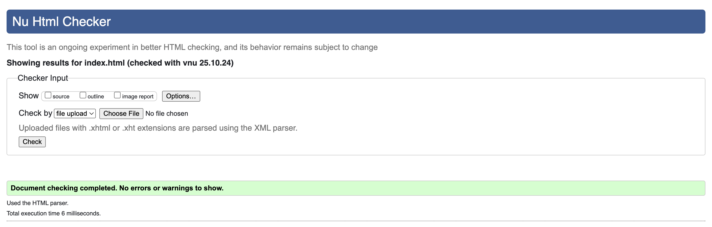
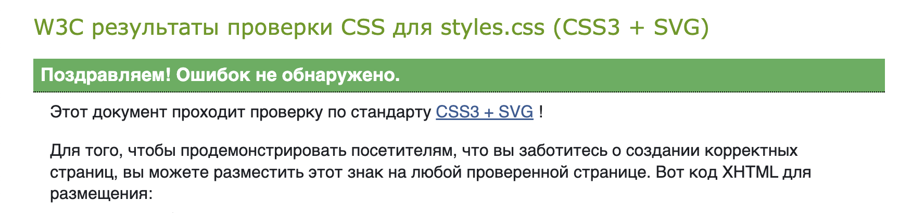

# Лабораторная работа №1

Веб-страница «Мой любимый фестиваль или концерт» — история, программа, фотоотчёты, впечатления.

[Ссылка на сайт](https://exage.github.io/WT_1/)

## Lighthouse

### Desktop


### Mobile


## Валидаторы HTML/CSS

### HTML



### CSS



## Архитектура вёрстки (Flex / Grid / медиазапросы)

### Базовые принципы

Контент обёрнут в `.container` (max-width: `1116px`, боковые поля из CSS-переменных).

Дизайн-токены в `:root`: цвета, типографика, отступы, радиусы — для единообразия и лёгкой смены темы.

Типографика: базовый размер `16px` (`html{font-size:62.5%}` для удобных rem), заголовки через модификатор `.title`.

### Зоны с Flex

`.intro__content` — вертикальное центрирование логотипа/текста/кнопки:

`display:flex; flex-direction:column; align-items:center; justify-content:center;`
`.intro__bottom` — центрирование кнопки:

`display:flex; justify-content:center;`
`.day__title` — размещение заголовка дня и дня недели в одну строку:

`display:flex; align-items:center;` (разделитель реализован через `::before` у `.day__title--weekday`)

### Зоны с Grid

Галерея `.images` — адаптивная сетка карточек:

```css
.images {
  display: grid;
  grid-template-columns: repeat(auto-fit, minmax(300px, 1fr));
  gap: var(--space-2);
}
.images__item { border-radius: var(--radius); overflow:hidden; height:30rem; }
.images__item img { width:100%; height:100%; object-fit:cover; }
```

* Расписание `.program` — сетка из трёх колонок на десктопе:

```css
.program {
  display: grid;
  grid-template-columns: 1fr 1fr 1fr;
  column-gap: 3rem;
  row-gap: 1.5rem;
  padding: 3rem 0;
}
```

### Медиазапросы и адаптив

Используются три ключевых порога: **1024px**, **580px**, **444px**.

`@media (max-width: 1024px)` — планшет:

Уменьшение вертикальных отступов (`.intro { margin-bottom: 4.2rem; }`).
Контейнер с меньшими внутренними полями.
Рекомендуемая адаптация сетки расписания до двух колонок:

```css
@media (max-width: 1024px) {
  .program { grid-template-columns: 1fr 1fr; }
}
```

`@media (max-width: 580px)` — мобильные:

Интро переводится в «поток»: высота авто, оверлей перестаёт быть абсолютным:

```css
@media (max-width: 580px) {
  .intro { height: auto; }
  .intro__content--wrapper { position: static; }
  .program { grid-template-columns: 1fr; }
}
```

`@media (max-width: 444px)` — узкие экраны:

Галерея в одну колонку (важно: сохраняем **grid**, а не `flex-direction`):

```css
@media (max-width: 444px) {
  .images {
    grid-template-columns: 1fr;
    row-gap: var(--space-6);
    max-height: 100%;
  }
}
```
