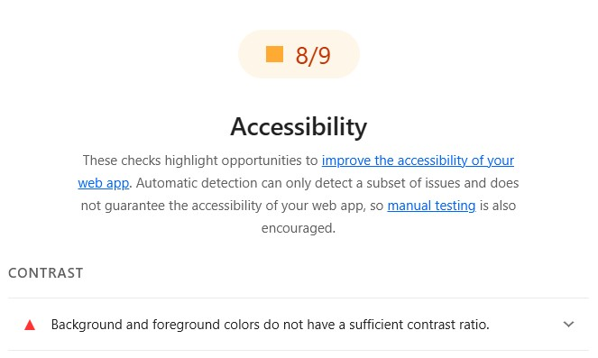
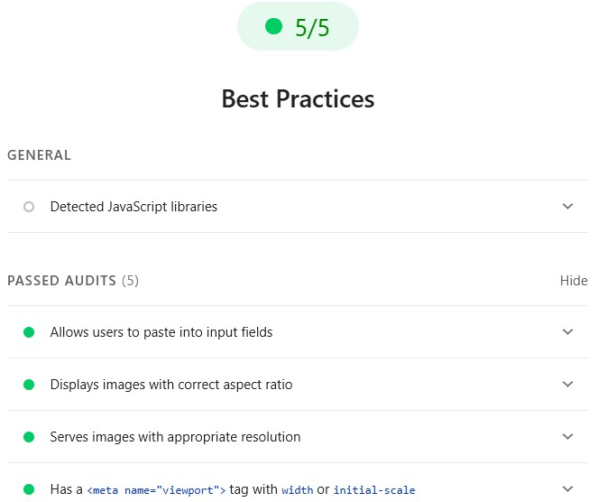
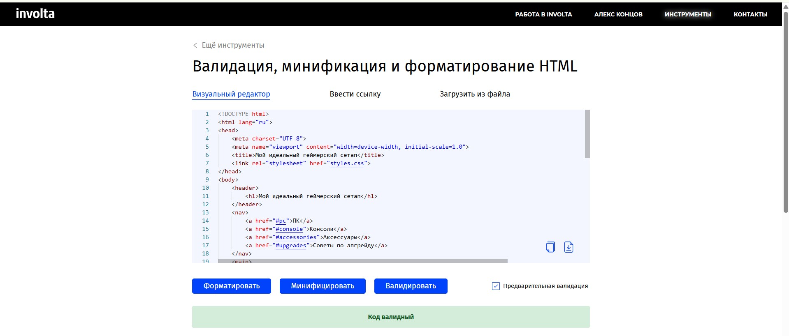
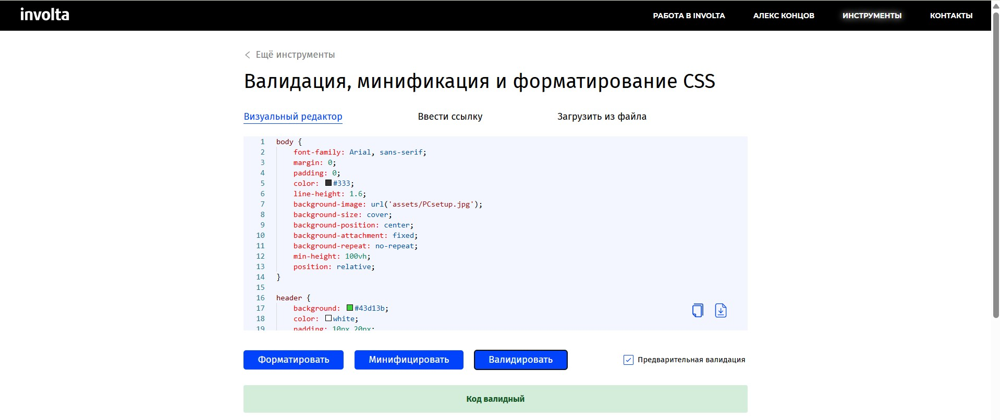
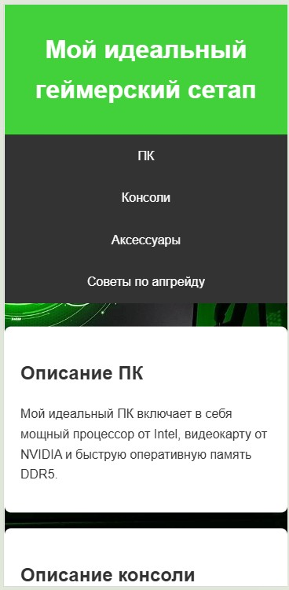
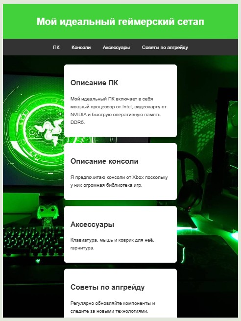
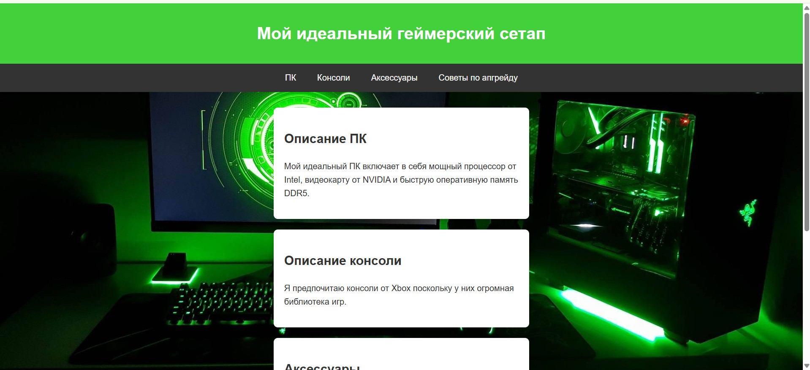

# Отчёт по вёрстке: "Мой идеальный геймерский сетап"

## 1. Результаты тестирования

### Lighthouse





### Валидация HTML



### Валидация CSS



## 2. Адаптивная вёрстка

### Брейкпоинты

#### Мобильная версия (320px - 767px)



**Особенности:**
- Одноколоночная layout
- Уменьшенные размеры шрифтов
- Компактные отступы

#### Планшетная версия (768px - 1023px)



**Особенности:**
- Двухколоночная сетка
- Средние размеры элементов
- Адаптивные изображения

#### Десктопная версия (1024px+)



**Особенности:**
- Трёхколоночная сетка
- Полноразмерные элементы
- Максимальная ширина контейнера

## 3. Архитектура вёрстки

## Используемые технологии

- **HTML5** - семантическая разметка с современными тегами (header, nav, main, section, footer)
- **CSS3** - каскадные таблицы стилей с переменными (CSS Custom Properties)
- **Flexbox** - для навигационного меню
- **Медиазапросы** - mobile-first адаптивный дизайн

## Структура сеток

### Flex области

Основные компоненты используют CSS Flex с адаптивными колонками:

```css
nav {
    display: flex;
    justify-content: center;
    background: #333;
}

main {
    padding: 20px;
    display: flex;
    flex-direction: column;
    align-items: center;
}

@media (min-width: 601px) and (max-width: 1024px) {
    main {
        flex-direction: row;
        flex-wrap: wrap;
        justify-content: center;
    }
}
