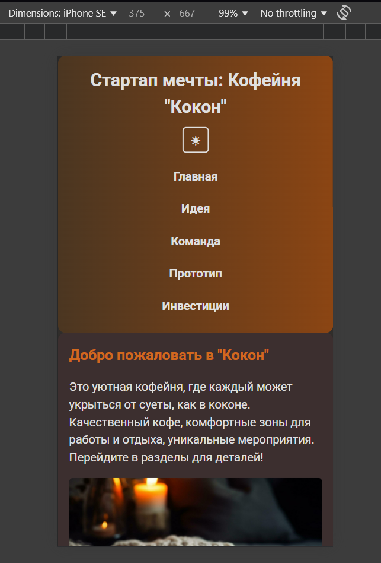
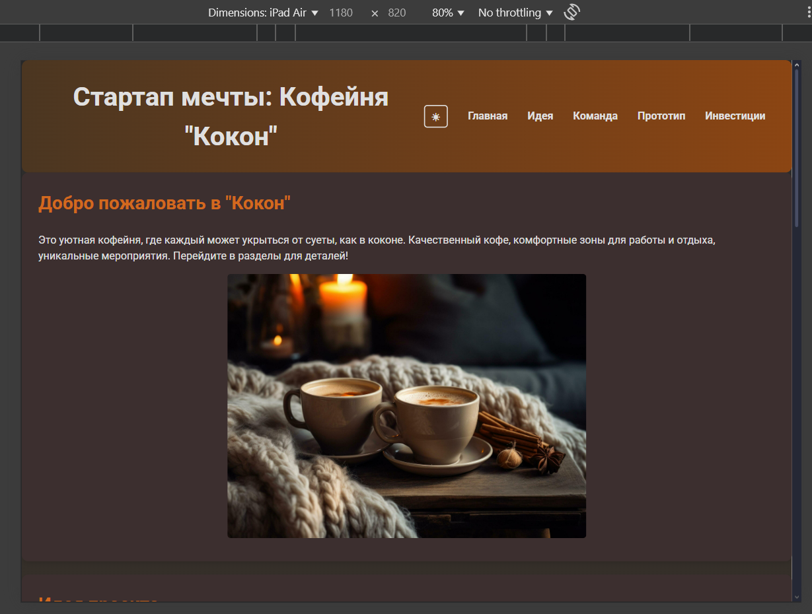
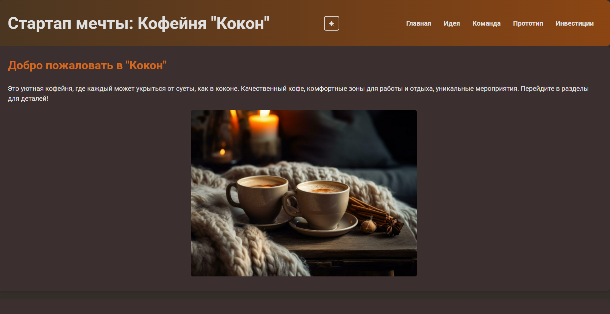
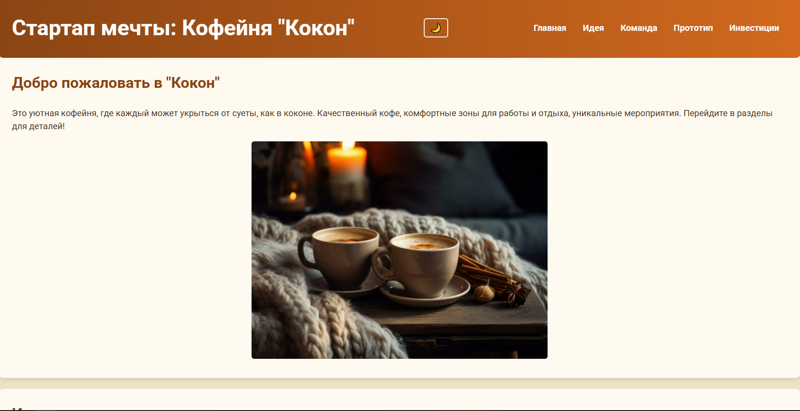

# Отчёт ЛР№1

Кофейня "Кокон" - Одностраничный сайт

**Описание проекта**
Одностраничный сайт для стартапа кофейни "Кокон", представляющий концепцию уютного пространства для работы и отдыха. Сайт реализован с использованием семантической HTML5-разметки, адаптивной вёрстки (mobile-first, 3 брейкпойнта), Flexbox и CSS Grid.

## Структура проекта

- index.html: Основной файл с семантической разметкой (header, nav, main, section, footer)
- styles.css: Стили с mobile-first подходом, Flexbox (навигация), CSS Grid (основной контент на десктопе), тёмная тема через prefers-color-scheme
- img/: Директория с изображениями:
  - CoffeeShop.jpg (Главная)
  - CoffeShopIdea.jpg (Идея)
  - CoffeShopPrototype.jpg (Прототип)

## Архитектура вёрстки

### Зоны Flexbox

Навигация (nav): Flexbox с flex-direction: column для мобильных устройств, переключается на row для планшетов и десктопов.

### Зоны CSS Grid

Основной контент (main): На десктопах используется grid-template-columns: repeat(auto-fit, minmax(300px, 1fr)) для адаптивного размещения секций.

### Медиазапросы

- ≤600px: Мобильная вёрстка, одноколоночный layout, уменьшенные отступы и шрифты
- 601–1024px: Планшетная вёрстка, горизонтальная навигация, увеличенные шрифты и отступы
- ≥1024px: Десктопная вёрстка, сетка для секций, максимальная ширина 1200px

## Lighthouse

- Производительность: ≥ 77
- Специальные возможности: 100
- Рекомендации: 100
- Поисковая оптимизация: 91

## Валидаторы

- HTML: W3C Validator, без ошибок
- CSS: W3C CSS Validator, без ошибок

## Брейкпойнты

**Мобильный (≤600px):**

**Планшет (601–1024px):**

**Десктоп (>1024px):**

## Ссылка на GithubPages

https://frosyka.github.io

## Установка и запуск

1. Склонируйте репозиторий: `git clone https://github.com/Frosyka/WT-AC-2025`
2. Откройте index.html в браузере или разверните на локальном сервере (npx serve)
3. Проверьте адаптивность через DevTools (Device Mode)
