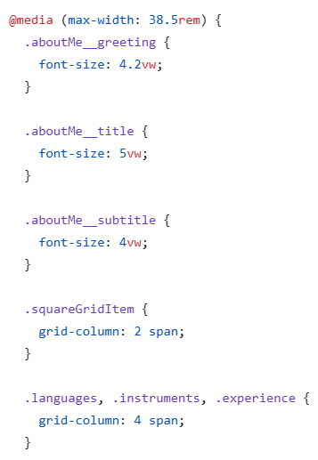
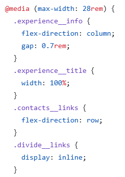
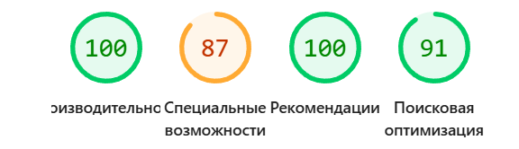

## Описание
Проект представляет собой резюме. В нём используются Flexbox, Grid, медиа-запросы. Для удобства стилизации подключен предпроцессор стилей SASS. Также можно отредактировать содержимое контента и сохранить в формате pdf.

## Breakpoints

## Lighthouse

## Локальный запуск проекта

**Способ 1:** Откройте файл index.html в браузере (двойной клик).

**Способ 2:** Запустите через Live Server (если используете VS Code):

## Онлайн версия

Доступна по ссылке: [https://Catsker.github.io/resume-project/](https://Catsker.github.io/resume-project/)
