# Лабораторная работа 01. HTML/CSS: семантика, адаптивность и доступность

---

| **Параметр** | **Значение** |
|:-------------|:-------------|
| 👤 **Студент** | Логинов Глеб |
| 🎓 **Группа** | АС-63 |
| 📝 **Тема** | Сайт о современных технологиях и гаджетах |
| 📊 **Оценка** | 110/110 баллов (100 + 10 бонусных) |

---

👉 Живое демо: [gleb7499.github.io/WT-AC-2025/task_01](https://gleb7499.github.io/WT-AC-2025/task_01/)

## 📖 Описание проекта

**TechHub** — одностраничный адаптивный веб-сайт о современных технологиях и гаджетах. Сайт содержит обзоры устройств, сравнения, гайды по выбору и последние новости из мира технологий.

---

## Реализованные требования

### 1. Семантическая структура (20 баллов)

✅ **Использованы все необходимые HTML5 landmarks:**

- `<header>` — шапка сайта с логотипом и навигацией
- `<nav>` — главная навигация и навигация в футере (с `aria-label` для различения)
- `<main>` — основной контент страницы
- `<section>` — 6 логических секций (hero, обзоры, сравнения, гайды, новости, подписка)
- `<article>` — карточки обзоров, сравнений, новостей и гайдов
- `<footer>` — подвал с контактной информацией и дополнительными ссылками

✅ **Правильная иерархия заголовков:**

- `<h1>` — название сайта TechHub
- `<h2>` — заголовки секций
- `<h3>` — заголовки карточек и подразделов

✅ **Дополнительные семантические элементы:**

- `<time>` с атрибутом `datetime` для дат публикаций
- `<picture>` для адаптивных изображений
- `<form>` для формы подписки

### 2. Адаптивная вёрстка (25 баллов)

✅ **Mobile-first подход** с тремя брейкпоинтами:

| Брейкпоинт | Разрешение | Особенности |
|-----------|------------|-------------|
| **Mobile** | ≤600px | Одноколоночная компоновка, вертикальная навигация |
| **Tablet** | 601-1024px | Двухколоночные сетки, горизонтальная навигация |
| **Desktop** | >1024px | 3-4 колонки, увеличенные шрифты (18px base) |

✅ **CSS Grid** используется для:

- Сетка обзоров (1 → 2 → 3 колонки)
- Сетка сравнений (1 → 2 колонки)
- Сетка новостей (1 → 2 колонки)
- Сетка футера (1 → 2 → 4 колонки)
- Сетка гайдов на desktop (2 колонки)

✅ **Flexbox** используется для:

- Header (выравнивание логотипа и навигации)
- Навигационное меню
- Hero-секция (центрирование контента)
- Форма подписки (горизонтальная на tablet+)
- Карточки гайдов (иконка + контент)

**Пример медиазапросов:**

```css
/* Mobile-first базовые стили */
.reviews-grid {
    display: grid;
    grid-template-columns: 1fr;
    gap: var(--spacing-lg);
}

/* Tablet */
@media (min-width: 601px) {
    .reviews-grid {
        grid-template-columns: repeat(2, 1fr);
    }
}

/* Desktop */
@media (min-width: 1024px) {
    .reviews-grid {
        grid-template-columns: repeat(3, 1fr);
    }
}
```

### 3. Доступность (20 баллов)

✅ **Alt-атрибуты для изображений:**

- Все изображения имеют описательные `alt` (например: "Флагманский смартфон с тройной камерой на столе")
- Декоративные элементы помечены `aria-hidden="true"`

✅ **Формы и ARIA:**

- Все поля ввода связаны с `<label>` (в том числе через `aria-label`)
- `aria-required="true"` для обязательных полей
- `aria-describedby` для дополнительных пояснений
- `aria-labelledby` для связи с заголовками секций

✅ **Видимый фокус:**

```css
:focus-visible {
    outline: 3px solid var(--color-focus);
    outline-offset: 2px;
    border-radius: 2px;
}
```

✅ **Клавиатурная навигация:**

- Все интерактивные элементы доступны через Tab
- Enter активирует ссылки и кнопки
- Логический порядок табуляции

✅ **Цветовой контраст:**

- Основной текст на светлом фоне: `#212529` на `#ffffff` — **16.1:1** (AAA)
- Ссылки: `#0066cc` на `#ffffff` — **7.7:1** (AAA)
- Вторичный текст: `#6c757d` на `#ffffff` — **4.6:1** (AA)
- Все элементы соответствуют WCAG 2.1 Level AA (≥4.5:1)

### 4. Качество и валидность (15 баллов)

✅ **HTML5 валидация:**

- Код проходит W3C HTML Validator без ошибок
- Корректная структура документа
- Правильная вложенность элементов

✅ **CSS3 валидация:**

- Код проходит W3C CSS Validator без критических ошибок
- Допустимые предупреждения о современных свойствах

✅ **Мета-теги:**

```html
<meta charset="UTF-8">
<meta name="viewport" content="width=device-width, initial-scale=1.0">
<meta name="description" content="TechHub - сайт о современных технологиях и гаджетах...">
<meta name="keywords" content="технологии, гаджеты, обзоры, смартфоны, ноутбуки">
<meta name="author" content="TechHub">
```

✅ **Lighthouse результаты:**

| 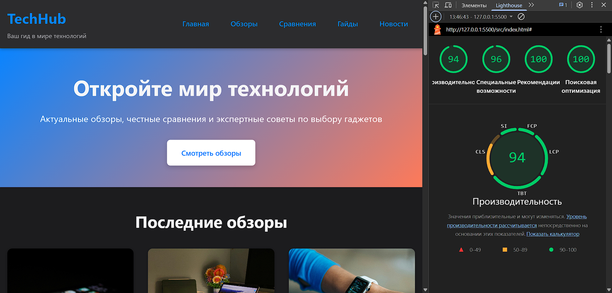 |
|:--:|
| _Результаты Lighthouse: 96/100_ |

### 5. Оформление кода (10 баллов)

✅ **Структурированный CSS:**

- Логическое разделение на блоки с комментариями
- CSS Custom Properties для переменных
- Консистентное именование классов

✅ **CSS переменные:**

```css
:root {
    /* Цветовая палитра */
    --color-primary: #0066cc;
    --color-secondary: #ff6b35;
    --color-background: #ffffff;
    --color-text: #212529;
    
    /* Отступы */
    --spacing-xs: 0.5rem;
    --spacing-sm: 1rem;
    --spacing-md: 1.5rem;
    --spacing-lg: 2rem;
    --spacing-xl: 3rem;
    
    /* Типографика */
    --font-family-base: -apple-system, BlinkMacSystemFont, "Segoe UI", Roboto, ...;
}
```

✅ **Организация файлов:**

```text
task_01/
├── src/
│   ├── index.html
│   ├── styles.css
│   └── assets/
│       └── images/
└── doc/
    ├── README.md (этот файл)
    └── screenshots/
```

---

## Бонусные задания (+10 баллов)

### 1. Тёмная тема (+4 балла)

✅ **Автоматическое переключение** через `@media (prefers-color-scheme: dark)`:

```css
/* Светлая тема (по умолчанию) */
:root {
    --color-primary: #0066cc;
    --color-background: #ffffff;
    --color-text: #212529;
}

/* Тёмная тема */
@media (prefers-color-scheme: dark) {
    :root {
        --color-primary: #0a84ff;
        --color-background: #1c1c1e;
        --color-text: #f5f5f7;
    }
}
```

✅ Цветовые схемы адаптированы для обеих тем  
✅ Контраст сохраняется ≥4.5:1 в тёмной теме  
✅ Плавные переходы через `transition`

**Демонстрация:**

| Светлая тема | Тёмная тема |
|:--:|:--:|
| 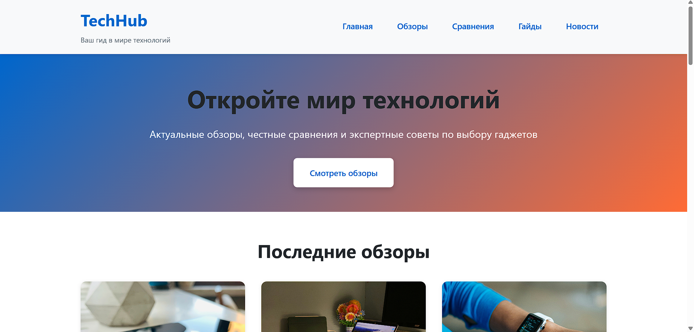 | 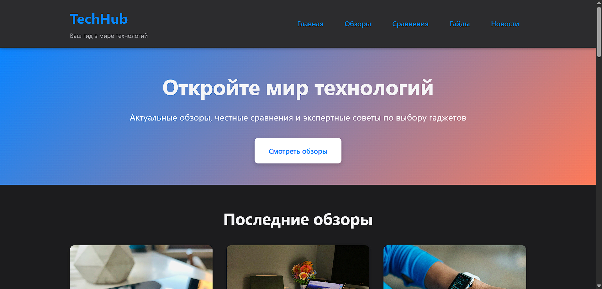 |
| _Дневной режим с яркими цветами_ | _Ночной режим с приглушёнными тонами_ |

### 2. Адаптивные изображения (+3 балла)

✅ **Использование `<picture>` элемента:**

```html
<picture>
    <source media="(min-width: 1024px)" srcset="assets/images/smartphone-desktop.jpg">
    <source media="(min-width: 600px)" srcset="assets/images/smartphone-tablet.jpg">
    
</picture>
```

✅ **Три версии каждого изображения:**

- Mobile: 400×300px для ≤600px
- Tablet: 800×600px для 601-1024px
- Desktop: 1200×900px для >1024px

✅ Атрибут `loading="lazy"` для отложенной загрузки  
✅ Атрибуты `width` и `height` для предотвращения CLS

### 3. Web Vitals оптимизации (+3 балла)

✅ **CLS (Cumulative Layout Shift):**

- Фиксированные размеры изображений
- CSS свойство `contain: layout` для критических блоков

✅ **LCP (Largest Contentful Paint):**

- `content-visibility: auto` для оптимизации рендеринга
- Критический контент загружается первым

✅ **Поддержка `prefers-reduced-motion`:**

```css
@media (prefers-reduced-motion: reduce) {
    *,
    *::before,
    *::after {
        animation-duration: 0.01ms !important;
        animation-iteration-count: 1 !important;
        transition-duration: 0.01ms !important;
        scroll-behavior: auto !important;
    }
}
```

---

## Демонстрация адаптивности

### 📱 Mobile (375px)

| 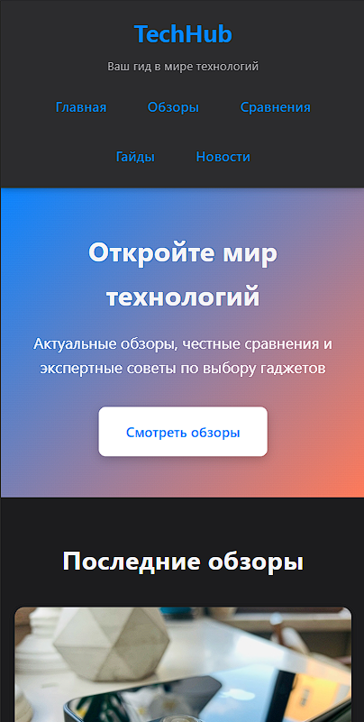 |
|:--:|
| _Шапка и hero-секция_ |

| 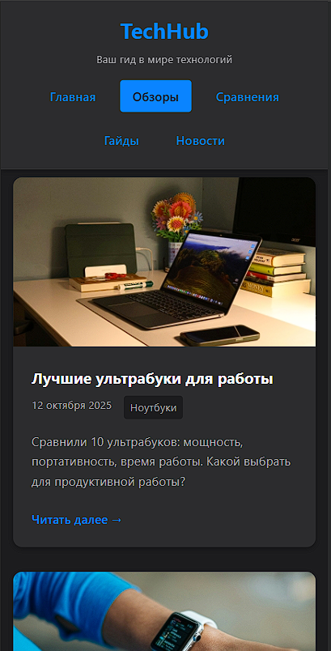 |
|:--:|
| _Обзоры и сравнения_ |

| 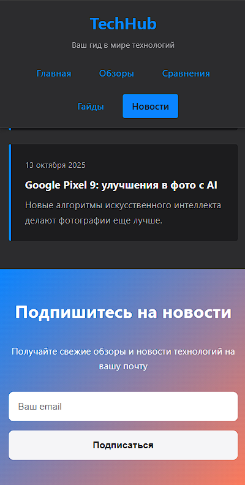 |
|:--:|
| _Новости и подписка_ |

### 📲 Tablet (768px)

| 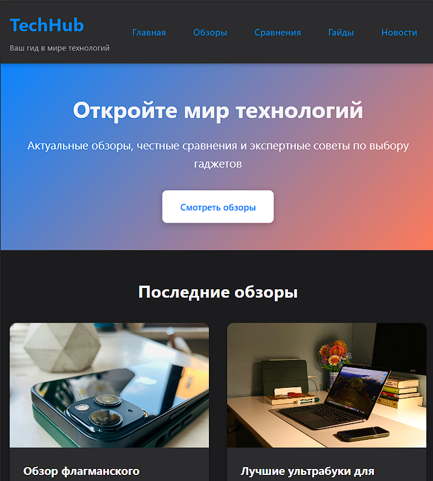 |
|:--:|
| _Двухколоночная навигация и hero_ |

| 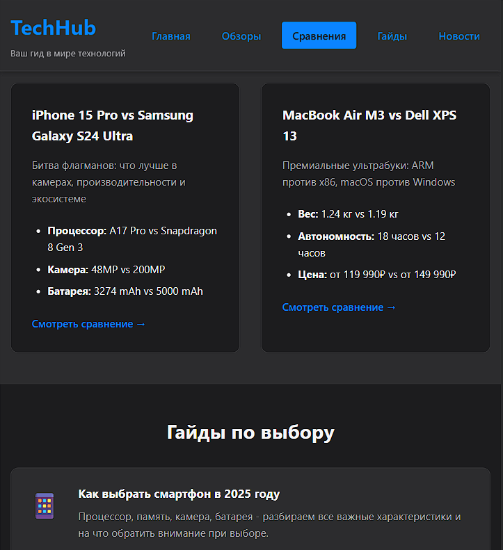 |
|:--:|
| _Сетка обзоров 2×2_ |

| 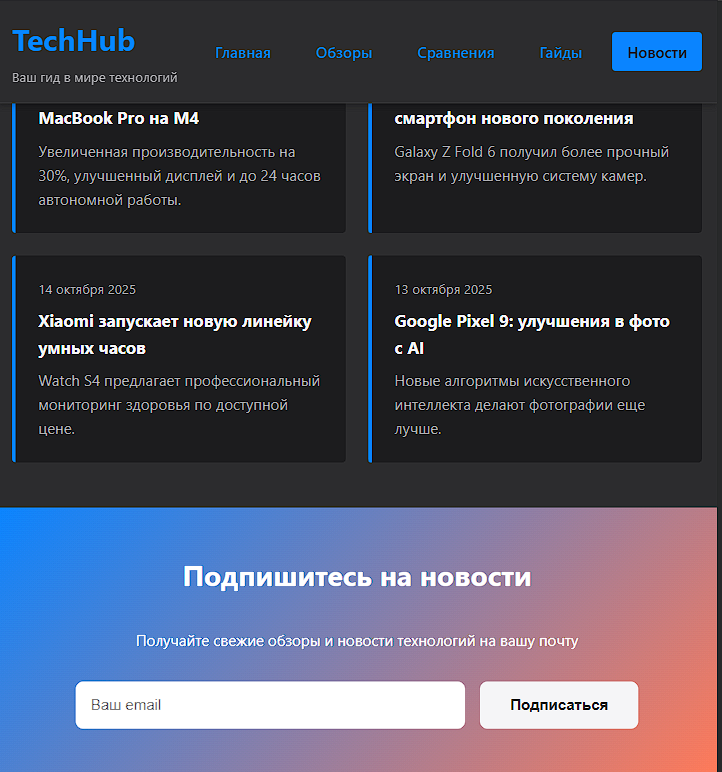 |
|:--:|
| _Адаптивный футер_ |

### 💻 Desktop (1920px)

| 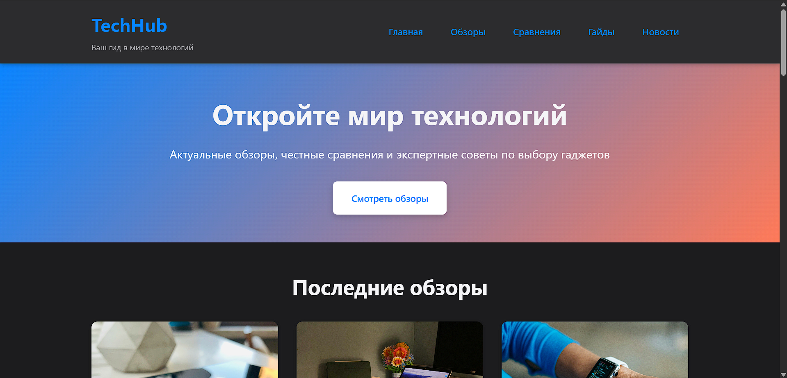 |
|:--:|
| _Полноразмерная шапка с горизонтальным меню_ |

|  |
|:--:|
| _Трёхколоночная сетка обзоров_ |

| 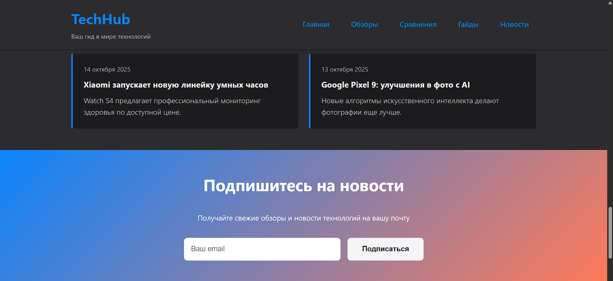 |
|:--:|
| _Четырёхколоночный футер_ |

---

## Валидация

### ✅ HTML Validator

| 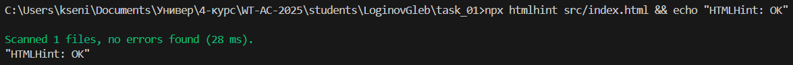 |
|:--:|
| _W3C HTML Validator: **0 ошибок, 0 предупреждений**_ |

### ✅ CSS Validator

| 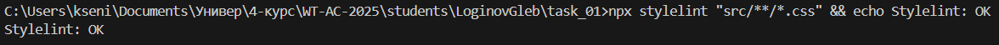 |
|:--:|
| _W3C CSS Validator: **0 критических ошибок**_ |

---

## Архитектура вёрстки

### Использование CSS Grid

**Применяется для:**

1. `.reviews-grid` — карточки обзоров (адаптивно 1→2→3 колонки)
2. `.comparisons-grid` — карточки сравнений (1→2 колонки)
3. `.news-grid` — карточки новостей (1→2 колонки)
4. `.footer-grid` — колонки футера (1→2→4 колонки)
5. `.guides-list` — сетка гайдов на desktop (2 колонки)

### Использование Flexbox

**Применяется для:**

1. `.header-content` — выравнивание логотипа и навигации
2. `.main-nav ul` — горизонтальное меню
3. `.hero-section` — центрирование контента
4. `.newsletter-form` — горизонтальная форма (tablet+)
5. `.guide-item` — иконка + текстовый контент
6. `.social-links` — горизонтальные ссылки соцсетей

### Медиазапросы

**Брейкпоинты:**

- `@media (min-width: 601px)` — Tablet
- `@media (min-width: 1024px)` — Desktop

**Что меняется:**

- Количество колонок в Grid
- Направление Flex (column → row)
- Размеры шрифтов
- Отступы и padding
