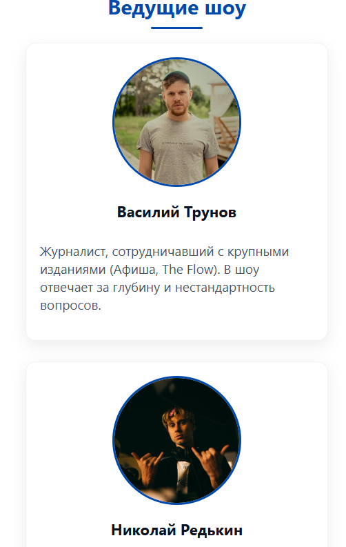
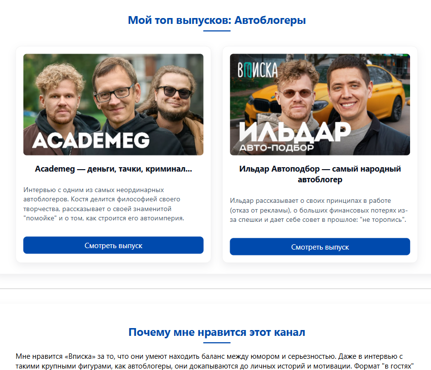
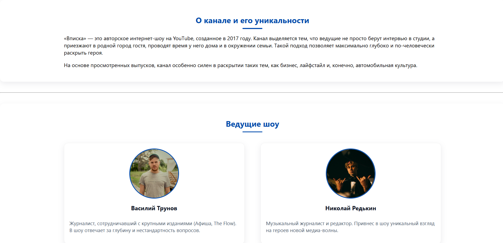
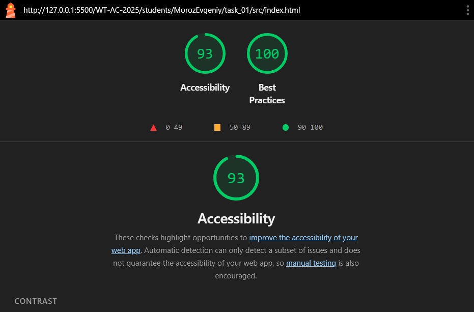
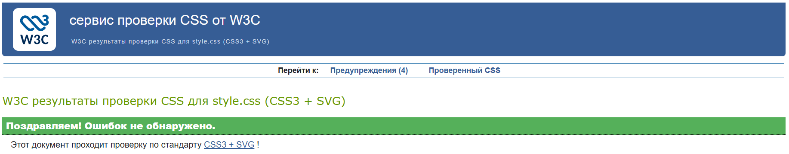

# Министерство образования Республики Беларусь

Учреждение образования

“Брестский Государственный технический университет”

Кафедра ИИТ

      

<strong>Лабораторная работа №1</strong>

<strong>По дисциплине:</strong> “Веб-технологии”

<strong>Тема:</strong> “HTML/CSS: семантика, адаптивность и доступность”

      

<strong>Выполнил:</strong>

Студент 4 курса

Группы АС-63

Мороз Е. В.

<strong>Проверил:</strong>

Несюк А.Н.

     

<strong>Брест 2025</strong>

---

## Цель работы

Освоить основы семантической вёрстки HTML5, реализовать адаптивную структуру веб-страницы по принципу **mobile-first** и обеспечить её доступность в соответствии с современными стандартами.

---

### Вариант №15

## Ход выполнения работы

### 1. Структура проекта

- `index.html` — основная страница
- `styles.css` — стилизация и медиазапросы
- `assets/` — изображения и дополнительные материалы

### 2. Реализованные элементы

В рамках лабораторной работы реализована адаптивная веб-страница, посвящённая YouTube-шоу «ВПИСКА» (фан-страница), содержащая информацию о канале, ведущих и подборку лучших выпусков (Academeg, Ильдар Автоподбор).

Реализованные особенности:
Семантическая структура HTML5: Использованы структурные теги header, nav, main, section, article, footer, а также корректная иерархия заголовков (h1-h4).

Сетки на основе CSS Grid и Flexbox:

Сетка карточек ведущих и выпусков (.hosts-grid, .episodes-grid) реализована с помощью CSS Grid (2 колонки на планшетах и десктопах).

Навигационное меню сверстано с использованием Flexbox.

Mobile-first подход с 2 брейкпоинтами:

≤600px — мобильная версия (вертикальный стек).

601–1024px — планшет.

1024px — десктоп.

Доступность (A11y): Все изображения снабжены атрибутом alt, обеспечена видимая подсветка фокуса (:focus-visible) и корректная навигация с клавиатуры.

Контрастность и CSS-переменные: Контрастность текста и фона соответствует WCAG (≈ 4.5:1). Палитра сайта полностью управляется CSS-переменными (:root).

Тёмная тема (Dark Mode): Реализовано переключение темы с помощью JavaScript и переменных, с сохранением выбора пользователя в localStorage.

Современные CSS-функции: Для адаптивности и стабильности макета использованы функции clamp() (для заголовков) и свойство aspect-ratio (для обложек выпусков).

### 3. Скриншоты работы сайта

👉 Вставьте сюда 3 скриншота:

- Мобильная версия (≤600px):

- Планшетная версия (601–1024px):

- Десктопная версия (>1024px):

---

## Проверка качества

### Lighthouse

👉 Вставьте результаты проверки Lighthouse (Accessibility, Best Practices ≥ 90):

### Валидаторы

👉 Вставьте результаты проверок:

- HTML Validator

- CSS Validator

---

## Таблица критериев

| Критерий                                | Выполнено |
|------------------------------------------|-----------|
| Семантика/структура (landmarks, заголовки) | ✅/ ✅ |
| Адаптивная вёрстка (2+ брейкпоинта, Flex/Grid) | ✅ / ✅ |
| Доступность (alt/label, фокус, контраст, клавиатура) | ✅ / ✅ |
| Качество и валидность (Lighthouse ≥ 90, валидаторы) | ✅ / ✅ |
| Оформление кода/структура проекта        | ✅ / ✅ |
| Публикация и отчёт                       | ✅ / ✅ |

### Дополнительные бонусы

| Бонус                                     | Выполнено |
|-------------------------------------------|-----------|
| Тёмная тема (prefers-color-scheme)        | ✅ / ✅ |
| Адаптивные изображения (picture/srcset)   | ✅ / ✅ |
| Улучшения Web Vitals (CLS/LCP/INP)        | ✅ / ✅ |

---

## Ссылка на публикацию

👉 Вставьте ссылку на GitHub Pages: https://eugenefr0st.github.io/WT/

## Вывод

Веб-страница о любимом YouTube-канале реализована с использованием современных технологий. В проекте применены семантическая разметка, доступная навигация и адаптивный дизайн на Flex/Grid.

Реализована тёмная тема с автоматическим определением системных настроек и ручным переключателем. Изображения адаптируются под разные устройства.

В работе использованы HTML, CSS. Освоены навыки создания доступных и адаптивных веб-страниц, работа с CSS-переменными и медиазапросами.
