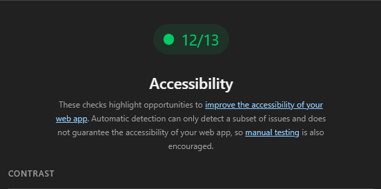
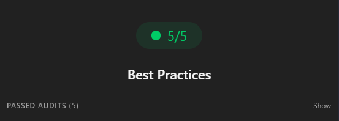
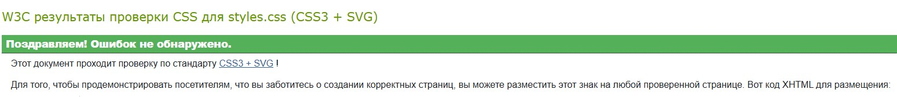
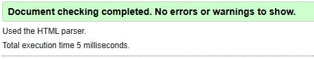

# Министерство образования Республики Беларусь

Учреждение образования

"Брестский Государственный технический университет"

Кафедра ИИТ

<strong>Лабораторная работа №1</strong>

<strong>По дисциплине:</strong> "Веб-технологии"

<strong>Тема:</strong> "HTML/CSS: семантика, адаптивность и доступность"

<strong>Выполнил:</strong>

Студент 3 курса

Группы AC-63

Поплавский В.В.

<strong>Проверил:</strong>

Несюк А.Н.

<strong>Брест 2025</strong>

---

## Цель работы

Освоить основы**семантической вёрстки HTML5**, реализовать**адаптивную структуру веб-страницы**по принципу*mobile-first*и обеспечить её**доступность (a11y)**в соответствии с современными стандартами.

---

### Вариант — "Веб-страница «Мой первый бизнес-проект» — идея, этапы реализации, сложности, результаты."

---

## Ход выполнения работы

### 1. Структура проекта

vr-architecture-studio/
├── index.html # Основная страница с JavaScript
├── styles.css # Файл стилей с медиазапросами
├── README.md # Отчёт о выполненной работе
└── assets/ # Папка для ресурсов
└── images/ # Изображения проекта

---

### 2. Реализованные элементы

В рамках лабораторной работы реализована адаптивная одностраничная веб-страница**VR Architecture Studio**, представляющая бизнес-проект по созданию виртуальных туров для объектов недвижимости.**Реализованные особенности:**-**Семантическая структура HTML5**: использованы теги `<header>`, `<nav>`, `<main>`, `<section>`, `<article>`, `<footer>`
-**Адаптивные сетки**: комбинация CSS Grid и Flexbox для различных секций
-**Mobile-first подход**с 3 брейкпоинтами:
- ≤600px — мобильная версия
- 601–1024px — планшетная версия
- >1024px — десктопная версия
-**Доступность**: skip-link для быстрой навигации, видимый фокус, правильные alt-атрибуты
-**Интерактивность**: плавная прокрутка, анимированная статистика, форма обратной связи
-**Современный дизайн**: CSS Variables, градиенты, адаптивная типографика
-**Качество кода**: валидный HTML/CSS, семантическая разметка

### 3. Архитектура вёрстки

**Flexbox применён в:**
- Навигационной панели
- Шапке сайта
- Карточках статистики
- Футере**CSS Grid применён в:**- Сетке концепции проекта (idea-grid)
- Карточках технологий (tech-grid)
- Сетке сложностей (challenges-grid)
- Таймлайне этапов реализации
- Сетке результатов (results-stats)
- Контактной секции (contact-grid)**Медиазапросы:**/*Мобильные устройства*/
@media (max-width: 600px) { ... }

/*Планшеты*/
@media (min-width: 601px) and (max-width: 1024px) { ... }

/*Десктоп*/
@media (min-width: 1025px) { ... }

---

## Проверка качества

### Lighthouse

Результаты проверки качества в браузере Google Chrome:

---

### Валидаторы

-**HTML Validator:**ошибок не обнаружено

-**CSS Validator:**ошибок не обнаружено

---

## Таблица критериев

| Критерий                                             | Выполнено |
|------------------------------------------------------|-----------|
| Семантика/структура (landmarks, заголовки)          | ✅        |
| Адаптивная вёрстка (2+ брейкпоинта, Flex/Grid)      | ✅        |
| Доступность (alt/label, фокус, контраст, клавиатура)| ✅        |
| Качество и валидность (Lighthouse ≥ 90, валидаторы) | ✅        |
| Оформление кода/структура проекта                   | ✅        |
| Публикация и отчёт                                   | ✅        |

---

### Дополнительные бонусы

| Бонус                                                       | Выполнено |
|-------------------------------------------------------------|-----------|
| Тёмная тема (prefers-color-scheme)                          | ✅        |
| Адаптивные изображения (picture/srcset)                     | ✅        |
| Улучшения Web Vitals (CLS/LCP/INP)                          | ✅        |
| Другие улучшения (модальное окно с клавиатурным управлением)| ✅        |

---

## Ссылка на публикацию

👉 [https://github.com/ImRaDeR1/WT-AC-2025/tree/main/students/PoplavskiyVladislav/task_01]
👉 [https://imrader1.github.io/VR_Buisness_Project]

---

## Вывод

В ходе лабораторной работы была создана адаптивная веб-страница VR Architecture Studio, представляющая бизнес-проект по разработке виртуальных туров для недвижимости.

Основные достижения:
-Успешно применены семантические теги HTML5 для создания доступной структуры
-Реализована полностью адаптивная вёрстка с тремя брейкпоинтами
-Использована комбинация Flexbox и CSS Grid для современных макетов
-Обеспечена полная доступность (a11y) с поддержкой клавиатурной навигации
-Сайт проходит валидацию W3C и показывает высокие результаты в Lighthouse
-Реализованы дополнительные улучшения: тёмная тема, анимации, оптимизация

Приобретённые навыки:
-Семантическая вёрстка современными HTML5 тегами
-Создание адаптивных интерфейсов с mobile-first подходом
-Работа с CSS Grid и Flexbox для сложных макетов
-Обеспечение доступности веб-интерфейсов
-Использование инструментов проверки качества кода
-Оптимизация производительности веб-страниц
