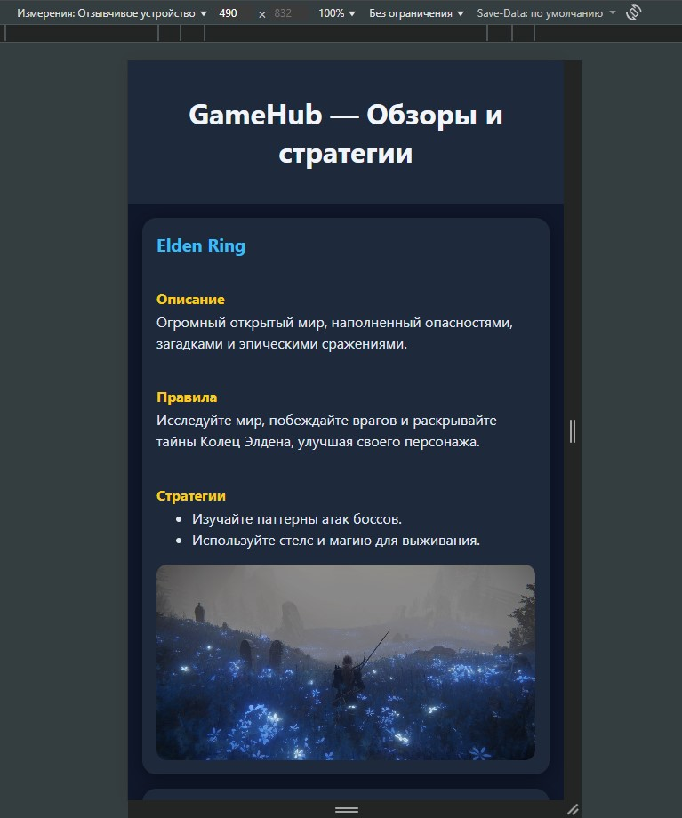
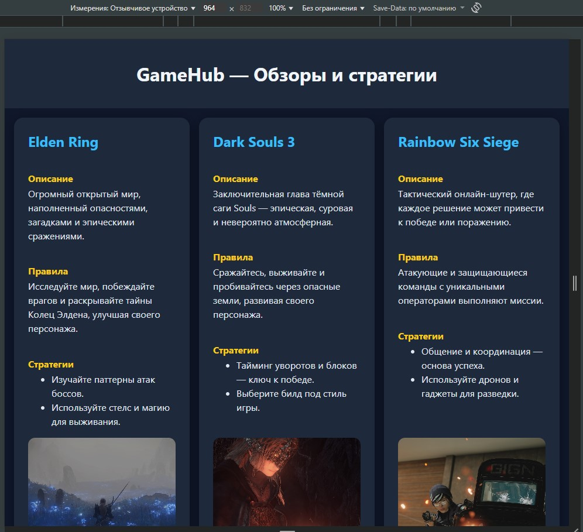
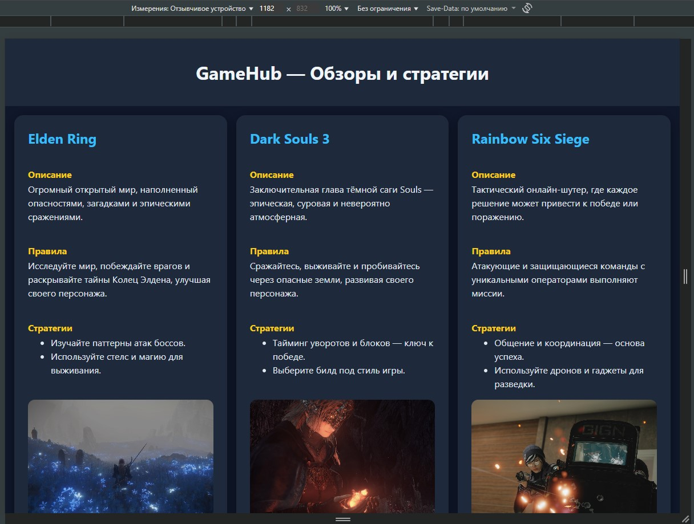
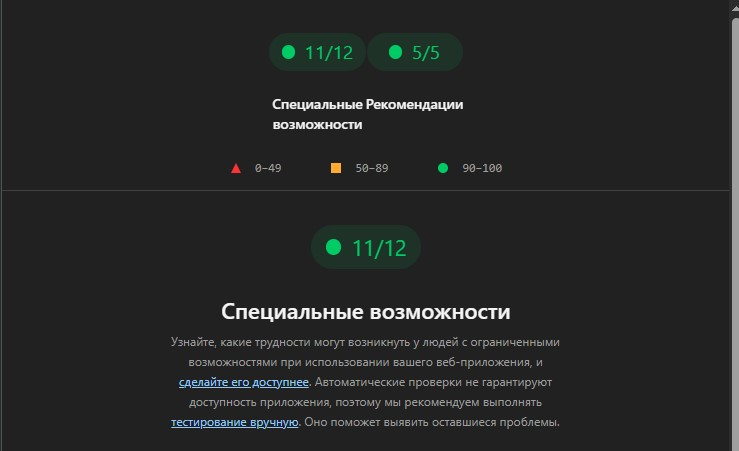
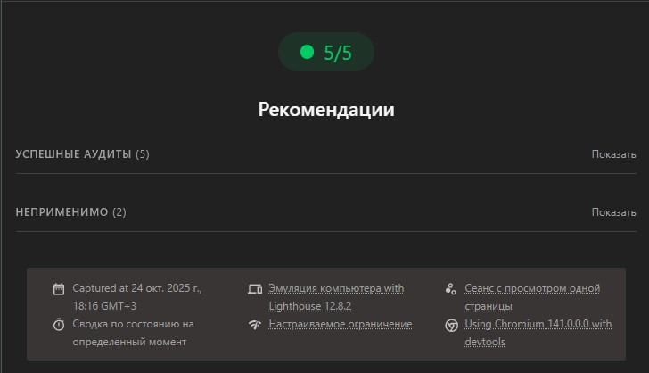
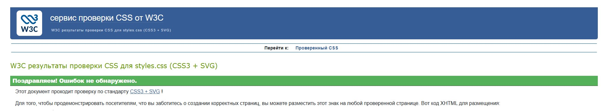

# Министерство образования Республики Беларусь

Учреждение образования

“Брестский Государственный технический университет”

Кафедра ИИТ

<strong>Лабораторная работа №1</strong>

<strong>По дисциплине:</strong> “Веб-технологии”

<strong>Тема:</strong> “HTML/CSS: семантика, адаптивность и доступность”

<strong>Выполнил:</strong>

Студент 4 курса

Группы АС-63

Савко П.С.

<strong>Проверил:</strong>

Несюк А.Н.

<strong>Брест 2025</strong>

---

## Цель работы

Освоить основы **семантической вёрстки HTML5**, реализовать **адаптивную структуру веб-страницы** по принципу *mobile-first* и обеспечить её **доступность (a11y)** в соответствии с современными стандартами.

---

### Вариант №18 — “Сайт о любимых играх — описание, правила, стратегии, обзоры.”

---

## Ход выполнения работы

### 1. Структура проекта

- `index.html` — основная страница
- `styles.css` — файл со стилями и медиазапросами
- `assets/` — изображения игр
- `README.md` — отчёт о выполненной лабораторной работе

---

### 2. Реализованные элементы

В рамках лабораторной работы реализована адаптивная страница **GameHub**, содержащая карточки любимых игр с описанием, правилами и стратегиями.

Реализованные особенности:
- Семантическая структура HTML5: использованы теги `<header>`, `<main>`, `<article>`, `<section>`, `<footer>`
- Сетки на основе **CSS Grid** и **Flexbox**
- **Mobile-first** подход с 2 брейкпоинтами:
  - ≤600px — мобильная версия
  - 601–1024px — планшет
  - >1024px — десктоп
- Все изображения снабжены атрибутом `alt`, интерактивные элементы — `tabindex`
- Реализовано модальное окно с клавиатурным управлением (`Enter`, `Esc`)
- Видимая подсветка фокуса и корректная навигация с клавиатуры
- Контрастность текста и фона соответствует WCAG (≈ 4.5:1)
- Добавлена автоматическая подстановка текущего года в футере
- Использованы адаптивные изображения через `srcset` и `sizes`

---

### 3. Скриншоты работы сайта

- **Мобильная версия (≤600px):**

- **Планшетная версия (601–1024px):**

- **Десктопная версия (>1024px):**

---

## Проверка качества

### Lighthouse

Результаты проверки качества в браузере Google Chrome:

---

### Валидаторы

- **HTML Validator:** ошибок не обнаружено

- **CSS Validator:** предупреждений и ошибок нет

---

## Таблица критериев

| Критерий                                             | Выполнено |
|------------------------------------------------------|-----------|
| Семантика/структура (landmarks, заголовки)          | ✅        |
| Адаптивная вёрстка (2+ брейкпоинта, Flex/Grid)      | ✅        |
| Доступность (alt/label, фокус, контраст, клавиатура)| ✅        |
| Качество и валидность (Lighthouse ≥ 90, валидаторы) | ✅        |
| Оформление кода/структура проекта                   | ✅        |
| Публикация и отчёт                                   | ✅        |

---

### Дополнительные бонусы

| Бонус                                                       | Выполнено |
|-------------------------------------------------------------|-----------|
| Тёмная тема (prefers-color-scheme)                          | ✅        |
| Адаптивные изображения (picture/srcset)                     | ✅        |
| Улучшения Web Vitals (CLS/LCP/INP)                          | ✅        |
| Другие улучшения (модальное окно с клавиатурным управлением)| ✅        |

---

## Ссылка на публикацию

👉 [https://github.com/1nsirius/WT-AC-2025/tree/main/students/SavkoPavel/task_01]
👉 [https://1nsirius.github.io/GameHub/]

---

## Вывод

В ходе лабораторной работы была создана **адаптивная веб-страница GameHub**, демонстрирующая обзоры и стратегии популярных игр.
При разработке применялись **семантические теги HTML5**, **CSS Grid/Flexbox**, подход *mobile-first*, а также принципы **доступности (a11y)**.
Сайт успешно прошёл проверку Lighthouse (≥90 баллов) и валидаторы W3C.

В результате я освоил:
- методы семантической вёрстки
- принципы адаптивного дизайна
- основы обеспечения доступности интерфейсов
- использование Lighthouse и валидаторов для анализа качества кода
