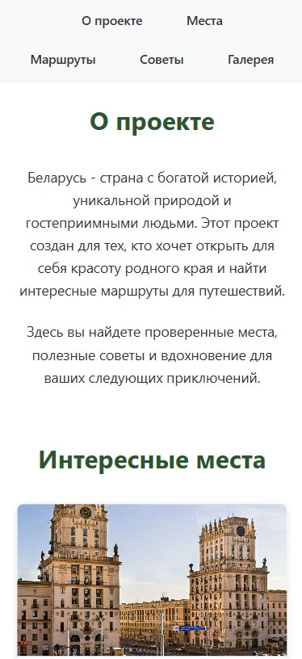
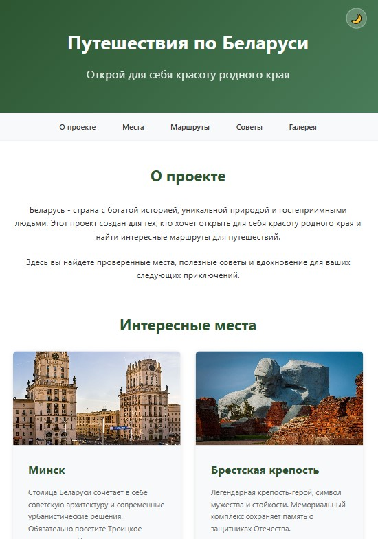
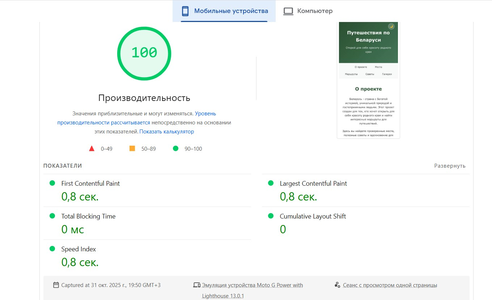
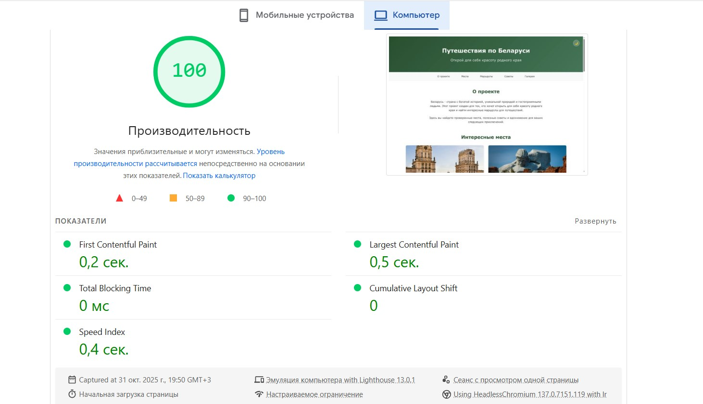
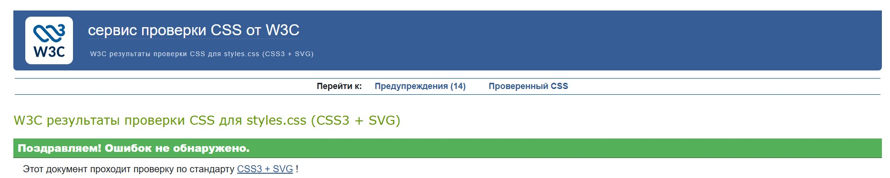

# Министерство образования Республики Беларусь

Учреждение образования

“Брестский Государственный технический университет”

Кафедра ИИТ

      

<strong>Лабораторная работа №1</strong>

<strong>По дисциплине:</strong> “Веб-технологии”

<strong>Тема:</strong> “HTML/CSS: семантика, адаптивность и доступность”

      

<strong>Выполнила:</strong>

Студентка 4 курса

Группы АС-64

Смердина А.В.

<strong>Проверил:</strong>

Несюк А.Н.

     

<strong>Брест 2025</strong>

---

## Цель работы

Освоить основы семантической вёрстки HTML5, реализовать адаптивную структуру веб-страницы по принципу **mobile-first** и обеспечить её доступность в соответствии с современными стандартами.

---

### Вариант №41

## Ход выполнения работы

### 1. Структура проекта

- `index.html` — основная страница
- `styles.css` — стилизация и медиазапросы
- `assets/` — изображения и дополнительные материалы

### 2. Реализованные элементы

В рамках лабораторной работы реализована адаптивная веб-страница, посвящённая путешествиям по Беларуси, содержащая информацию о интересных местах, маршрутах и полезных советах для туристов.

Семантическая структура HTML5:
использованы структурные теги header, nav, main, section, article, footer, а также корректная иерархия заголовков (h1-h4). Все разделы имеют соответствующие ARIA-атрибуты для улучшения доступности.

Адаптивные сетки на основе Float и медиазапросов:
- Сетка карточек мест и маршрутов реализована с помощью Float layout (1 колонка на мобильных, 2 колонки на планшетах, 2-4 колонки на десктопах)

- Навигационное меню сверстано с использованием inline-block элементов

- Галерея изображений адаптируется под разные размеры экранов

Mobile-first подход с 3 брейкпоинтами
- ≤600px — мобильная версия (вертикальный стек, 1 колонка)

- 601–1024px — планшет (2 колонки для карточек)

- >1024px — десктоп (2-4 колонки в зависимости от секции)

Доступность (A11y)
- Все изображения снабжены атрибутом alt с описательным текстом

- Обеспечена видимая подсветка фокуса (:focus) для клавиатурной навигации

- Реализован skip-link для быстрого перехода к основному контенту

- Корректная семантика и структура заголовков

- Соответствие контрастности WCAG 4.5:1

Тёмная тема (Dark Mode):
Реализовано переключение темы с помощью JavaScript и CSS классов, с сохранением выбора пользователя в localStorage. Система автоматически определяет предпочтения пользователя через prefers-color-scheme.

Адаптивная типографика и layout
- Отзывчивые размеры шрифтов с использованием em и rem

- Процентные расчеты для адаптивных сеток

- Медиазапросы для перестройки макета на разных устройствах

### 3. Скриншоты работы сайта

- Мобильная версия (≤600px):

- Планшетная версия (601–1024px):

- Десктопная версия (>1024px):

---

## Проверка качества

### Lighthouse

### Валидаторы

👉 Результаты проверок:

- HTML Validator

- CSS Validator

---

## Таблица критериев

| Критерий                                | Выполнено |
|------------------------------------------|-----------|
| Семантика/структура (landmarks, заголовки) | ✅|
| Адаптивная вёрстка (2+ брейкпоинта, Flex/Grid) | ✅|
| Доступность (alt/label, фокус, контраст, клавиатура) | ✅ |
| Качество и валидность (Lighthouse ≥ 90, валидаторы) | ✅ |
| Оформление кода/структура проекта        | ✅ |
| Публикация и отчёт                       | ✅ |

### Дополнительные бонусы

| Бонус                                     | Выполнено |
|-------------------------------------------|-----------|
| Тёмная тема (prefers-color-scheme)        | ✅ |
| Адаптивные изображения (picture/srcset)   | ✅ |
| Улучшения Web Vitals (CLS/LCP/INP)        | ✅ |

---

## Ссылка на публикацию

👉 Вставьте ссылку на GitHub Pages: https://pyrokekw.github.io/Siteforlab1/

## Вывод

Веб-страница о путешествиях по Беларуси реализована с использованием современных веб-технологий с акцентом на семантику, доступность и адаптивность. В проекте успешно применены семантическая разметка HTML5, доступная навигация и отзывчивый дизайн, построенный на Float layout с медиазапросами.
Реализована тёмная тема с автоматическим определением системных предпочтений пользователя через prefers-color-scheme и ручным переключателем с сохранением выбора в localStorage. Все изображения адаптированы под различные устройства и снабжены описательными alt-атрибутами.
