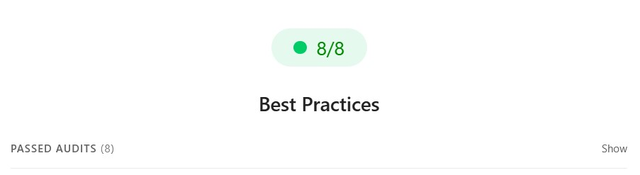
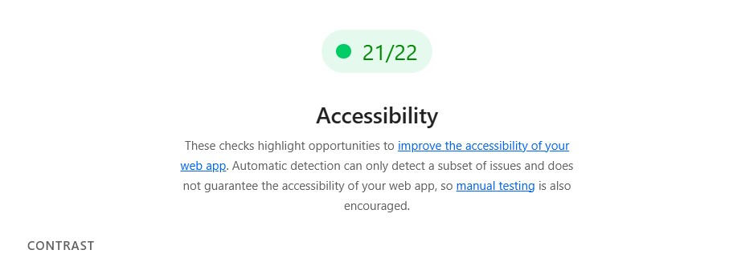
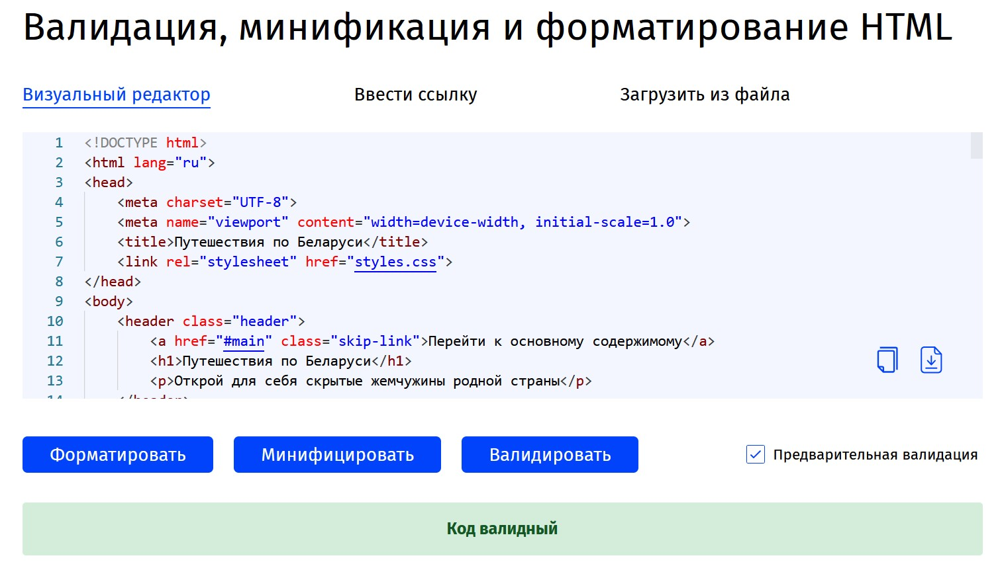
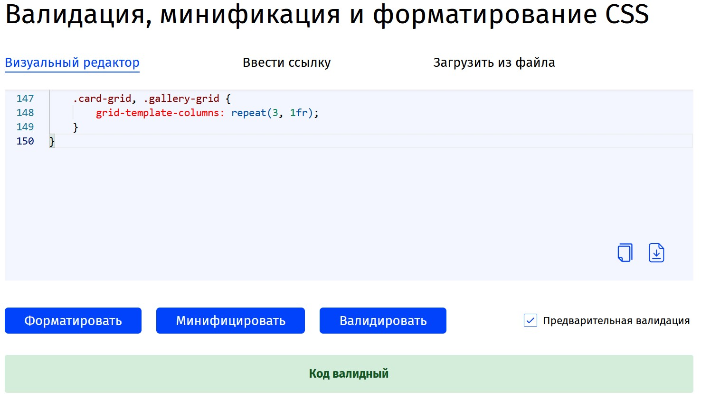
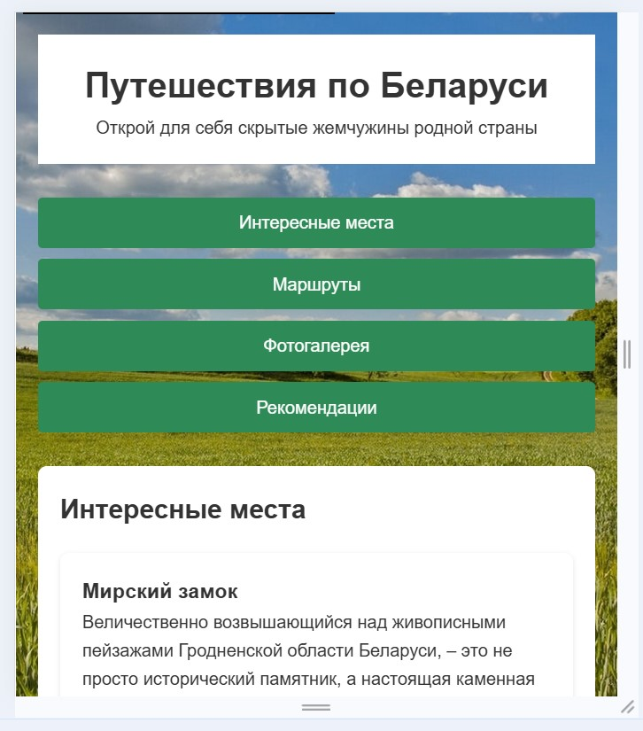
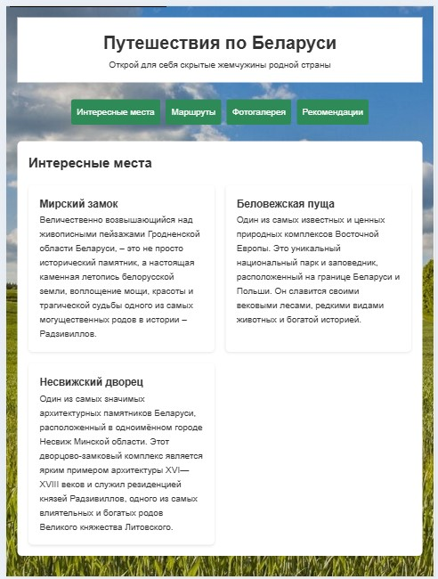
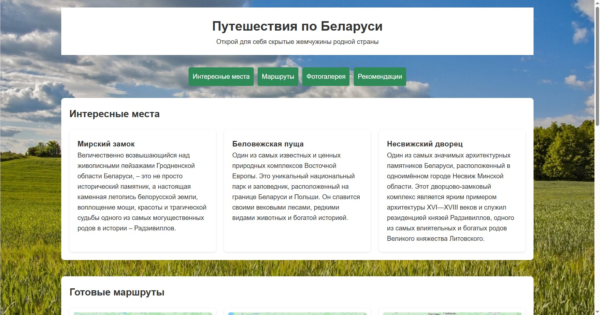

# Отчёт по вёрстке: "Путешествия по Беларуси"

## 1. Результаты тестирования

### Lighthouse

### Валидация HTML

### Валидация CSS

## 2. Адаптивная вёрстка

### Брейкпоинты

#### Мобильная версия (320px - 767px)

**Особенности:**

- Одноколоночная layout
- Уменьшенные размеры шрифтов
- Компактные отступы

#### Планшетная версия (768px - 1023px)

**Особенности:**

- Двухколоночная сетка
- Средние размеры элементов
- Адаптивные изображения

#### Десктопная версия (1024px+)

**Особенности:**

- Трёхколоночная сетка
- Полноразмерные элементы
- Максимальная ширина контейнера

## 3. # Архитектура вёрстки

## Используемые технологии

- **HTML5** - семантическая разметка с современными тегами (header, nav, main, section, footer)
- **CSS3** - каскадные таблицы стилей с переменными (CSS Custom Properties)
- **CSS Grid** - для карточек и галереи
- **Flexbox** - для навигационного меню
- **Медиазапросы** - mobile-first адаптивный дизайн

## Структура сеток

### Grid области

Основные компоненты используют CSS Grid с адаптивными колонками:

.card-grid, .gallery-grid {
    display: grid;
    grid-template-columns: 1fr;
    gap: 20px;
}

@media (width >= 601px) {
    .card-grid, .gallery-grid {
        grid-template-columns: repeat(2, 1fr);
    }
}

@media (width >= 1025px) {
    .card-grid, .gallery-grid {
        grid-template-columns: repeat(3, 1fr);
    }
}

## Медиазапросы

- **Мобильные**: до 600px (базовые стили)
- **Планшеты**: 601px - 1024px
- **Десктоп**: 1025px и выше

@media (width >= 601px) {

}

@media (width >= 1025px) {
    body {
        max-width: 1200px;
        margin: 0 auto;
    }
}

## Семантическая структура

### HTML5 семантика

- `<header>` - заголовок сайта
- `<nav>` - навигационное меню
- `<main>` - основной контент
- `<section>` - тематические блоки
- `<footer>` - подвал с контактами

### Доступность (a11y)

- ARIA-роли (banner, main, contentinfo)
- aria-labelledby для связи секций с заголовками
- Скип-ссылка для клавиатурной навигации
- Alt-атрибуты для всех изображений

## Компонентный подход

### Карточки (.card)

.card {
    padding: 20px;
    background: #fff;
    border-radius: 8px;
    box-shadow: 0 2px 5px rgb(0 0 0 / 10%);
}

### Галерея (.gallery-grid)

.gallery-grid figure {
    margin: 0;
    padding: 10px;
    background: #fff;
    border-radius: 8px;
    box-shadow: 0 2px 5px rgb(0 0 0 / 10%);
}
