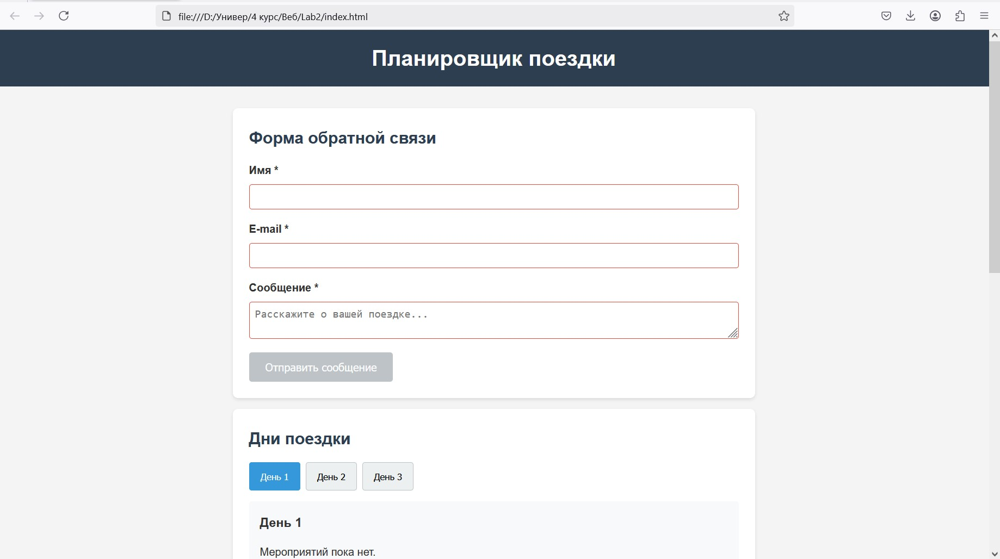

# Лабораторная работа 02. DOM и события

## Описание

Планировщик поездки с интерактивными компонентами на чистом JavaScript.

## Цели

- Работа с DOM и событиями
- Делегирование событий
- Доступность (a11y)
- Валидация форм

## Реализованные компоненты

### 1. Табы дней поездки

- Переключение между днями
- Динамическое добавление/удаление
- Клавиатурная навигация
- ARIA: `role="tablist"`, `aria-selected`, `aria-controls`

### 2. Аккордеон FAQ

- Раскрывающиеся секции вопросов
- Можно открывать несколько одновременно
- ARIA: `aria-expanded`, `aria-hidden`

### 3. Всплывающие подсказки

- Подсказки при наведении и фокусе
- Плавное появление
- ARIA: `data-tooltip`, `role="tooltip"`

### 4. Форма с валидацией

- Поля: имя, email, сообщение (20+ символов)
- Валидация в реальном времени
- Кнопка блокируется при ошибках

## Проверка функциональности

**Табы:**

- Клик по вкладкам "День 1", "День 2", "День 3"
- Клавиши ← → для навигации
- Кнопки "Добавить/Удалить день"

**Аккордеон:**

- Клик по вопросам для раскрытия
- Enter/Space для управления с клавиатуры

**Подсказки:**

- Наведите на кнопки с иконками 🏨🎫💊
- Tab для фокуса

**Форма:**

- Попробуйте отправить с ошибками
- Наблюдайте сообщения валидации

## Доступность

**Клавиатура:**

- Tab/Shift+Tab - навигация
- Enter/Space - активация
- Стрелки ← → - табы
- ESC - скрыть подсказки

**ARIA-атрибуты:**

- `aria-selected`, `aria-expanded`, `aria-invalid`
- `aria-live="polite"` для сообщений
- `role="tablist"`, `role="tooltip"`

## Удобство интерфейса

- Плавные анимации
- Визуальная обратная связь
- Адаптивный дизайн
- Четкие состояния фокуса

## Структура проекта

project/
├── index.html
├── styles.css
├── main.js
└── README.md

## Запуск

Откройте <https://kulibini.github.io/Lab2/> в браузере
