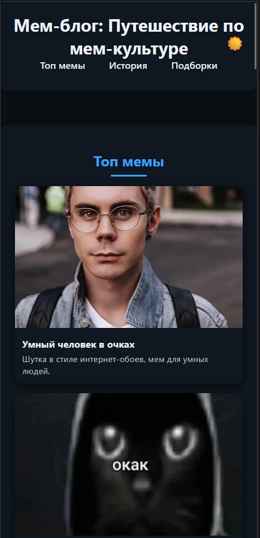
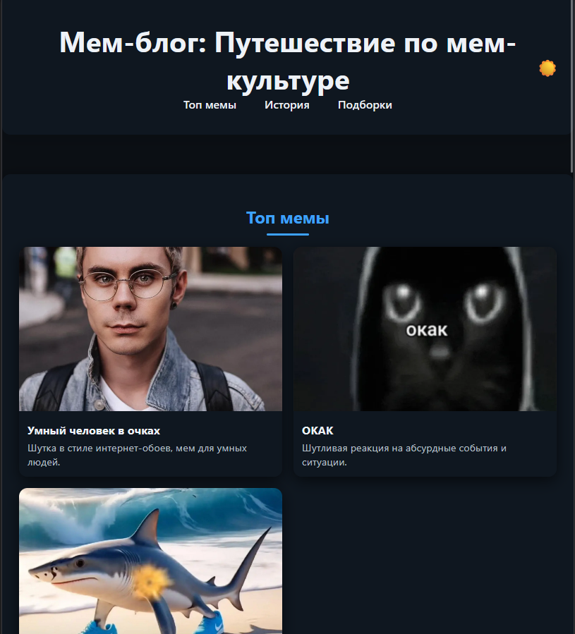
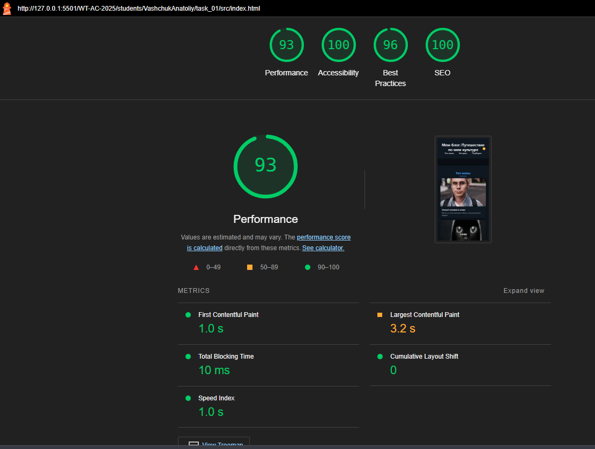
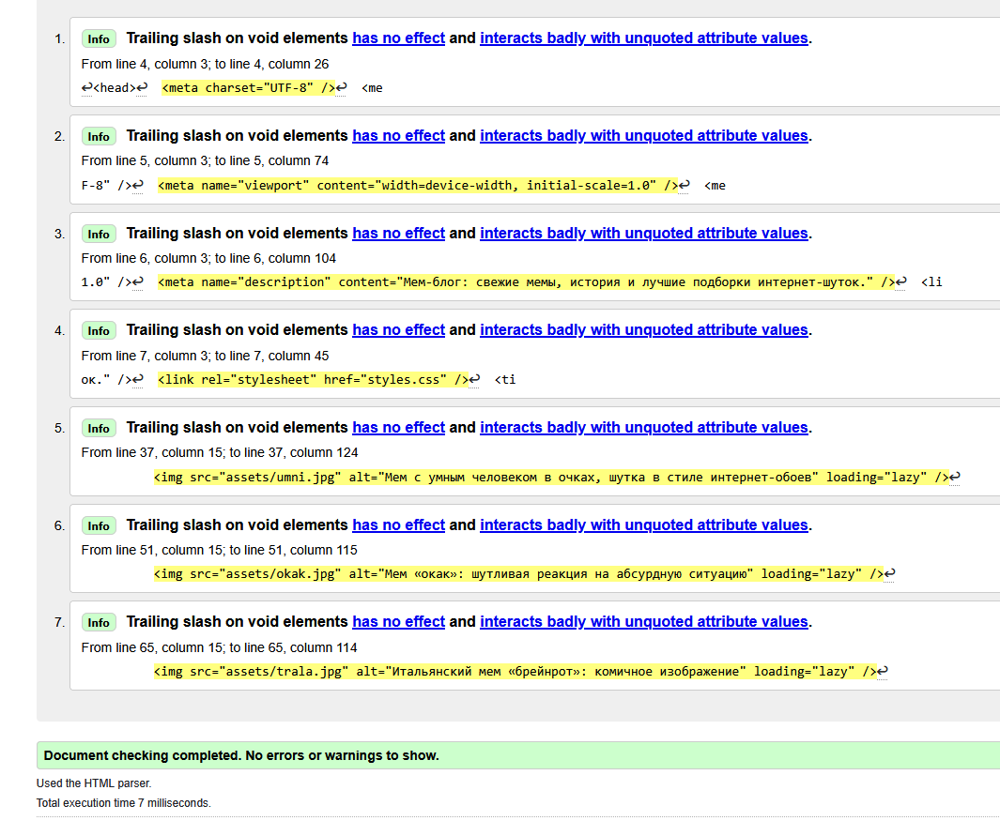
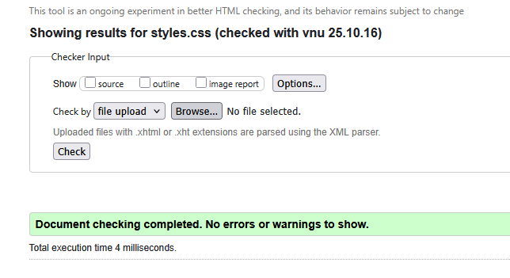

# Министерство образования Республики Беларусь

<p align="center">Учреждение образования</p>
<p align="center">“Брестский Государственный технический университет”</p>
<p align="center">Кафедра ИИТ</p>
<br><br><br><br><br><br>
<p align="center"><strong>Лабораторная работа №1</strong></p>
<p align="center"><strong>По дисциплине:</strong> “Веб-технологии”</p>
<p align="center"><strong>Тема:</strong> “HTML/CSS: семантика, адаптивность и доступность”</p>
<br><br><br><br><br><br>
<p align="right"><strong>Выполнил:</strong></p>
<p align="right">Студент 4 курса</p>
<p align="right">Группы АС-63</p>
<p align="right">Ващук А.В.</p>
<p align="right"><strong>Проверил:</strong></p>
<p align="right">Несюк А.Н.</p>
<br><br><br><br><br>
<p align="center"><strong>Брест 2025</strong></p>

---

## Цель работы

Освоить основы семантической вёрстки HTML5, реализовать адаптивную структуру веб-страницы по принципу **mobile-first** и обеспечить её доступность в соответствии с современными стандартами.

---

### Вариант №1

## Ход выполнения работы

### 1. Структура проекта

- `index.html` — основная страница
- `styles.css` — стилизация и медиазапросы
- `assets/` — изображения и дополнительные материалы

### 2. Реализованные элементы

#### Семантическая разметка HTML5

- Использованы основные семантические теги:  
  `<header>`, `<nav>`, `<main>`, `<section>`, `<article>`, `<footer>`.
- Для улучшения доступности применены атрибуты `role` (`banner`, `main`, `contentinfo`).

---

#### Flexbox и CSS Grid Layout

- Навигационное меню сверстано с помощью **Flexbox** с использованием свойства `gap`.
- Карточки мемов и подборок реализованы с помощью **CSS Grid** с адаптивной сеткой:

  ```css
  grid-template-columns: repeat(auto-fit, minmax(...));
  ```

---

#### Mobile-first медиазапросы (адаптивность)

Стили построены по **mobile-first** принципу: базовые стили предназначены для мобильных устройств,  
а затем добавлены два брейкпоинта:

```css
@media (min-width: 601px) {
  ...;
} /* для планшетов */
@media (min-width: 1025px) {
  ...;
} /* для десктопов */
```

---

#### Использование современных CSS-технологий

Применены:

- **CSS-переменные** (`:root`) для хранения цветов, размеров и отступов;
- функции `clamp()` — для адаптивных размеров шрифта;
- функции `color-mix()` — для плавного изменения оттенков при наведении;
- функции `minmax()` и `auto-fit` — для гибкой настройки сетки;
- свойство `aspect-ratio` — для сохранения пропорций изображений;
- плавные переходы (`transition`) и тени (`box-shadow`) для визуальной глубины и интерактивности.

---

#### Доступность (Accessibility)

- У всех изображений указаны **альтернативные тексты** (`alt`).
- Применены **ARIA-атрибуты**: `aria-label`, `aria-pressed`, `aria-labelledby` для улучшения взаимодействия со скринридерами.
- Реализована **видимая подсветка фокуса** (`:focus-visible`) для пользователей клавиатуры.
- Добавлена **skip-link** для быстрого перехода к основному контенту с клавиатуры.
- Использованы семантические `role` (`banner`, `main`, `contentinfo`).

---

#### Контрастность и читаемость

Цветовые сочетания подобраны с контрастностью не ниже **4.5:1**,  
что соответствует стандарту WCAG AA.  
Проверка выполнена с помощью [WebAIM Contrast Checker](https://webaim.org/resources/contrastchecker/).

---

#### Тёмная тема (Dark mode)

Реализовано переключение темы с помощью **JavaScript**:

- Кнопка переключателя имеет атрибут `aria-pressed` для доступности.
- Состояние темы сохраняется в `localStorage`.
- Поддерживается автоматическое определение системной темы через `prefers-color-scheme`.
- Цветовая палитра адаптируется с использованием CSS-переменных.

---

#### Кроссбраузерность и отзывчивость

- Макет корректно отображается на мобильных, планшетных и десктопных устройствах.
- Изображения масштабируются адаптивно (`max-width: 100%`).
- Используются современные стандарты HTML5 и CSS3, совместимые с основными браузерами (Chrome, Firefox, Edge, Safari).
- Типографика построена на современном шрифте `Inter` с fallback-семействами.

### 3. Скриншоты работы сайта

👉 Вставьте сюда 3 скриншота:

- Мобильная версия (≤600px):  
  

- Планшетная версия (601–1024px):  
  

- Десктопная версия (>1024px):  
  

---

## Проверка качества

### Lighthouse

👉 Вставьте результаты проверки Lighthouse (Accessibility, Best Practices ≥ 90):



### Валидаторы

👉 Вставьте результаты проверок:

- HTML Validator  
  

- CSS Validator  
  

---

## Таблица критериев

| Критерий                                             | Выполнено |
| ---------------------------------------------------- | --------- |
| Семантика/структура (landmarks, заголовки)           | ✅ / ✅   |
| Адаптивная вёрстка (2+ брейкпоинта, Flex/Grid)       | ✅ / ✅   |
| Доступность (alt/label, фокус, контраст, клавиатура) | ✅ / ✅   |
| Качество и валидность (Lighthouse ≥ 90, валидаторы)  | ✅ / ✅   |
| Оформление кода/структура проекта                    | ✅ / ✅   |
| Публикация и отчёт                                   | ✅ / ✅   |

### Дополнительные бонусы

| Бонус                                   | Выполнено |
| --------------------------------------- | --------- |
| Тёмная тема (prefers-color-scheme)      | ✅ / ✅   |
| Адаптивные изображения (picture/srcset) | ✅ / ✅   |
| Улучшения Web Vitals (CLS/LCP/INP)      | ✅ / ✅   |
| Другие улучшения (указать свои)         | ✅ / ✅   |

Другие улучшения:

- mobile-first подход

---

## Ссылка на публикацию

👉 Вставьте ссылку на GitHub Pages: https://skevet-avramuk.github.io/meme-blog/

## Вывод

В рамках проекта был разработан адаптивный мем-блог с использованием современных веб-технологий. Реализованы семантическая разметка (header, main, section, article, footer), навигация с доступностью (aria-label, фокус, skip-link), адаптивная сетка с Flex и Grid, мобильная-first верстка с двумя брейкпоинтами. Добавлена тёмная тема с использованием prefers-color-scheme и переключателем темы через JavaScript, а также адаптивные изображения с <picture> и srcset.

Освоены навыки семантической и доступной верстки, работы с CSS-переменными, Flex/Grid, медиа-запросами, оптимизации изображений и внедрения dark mode. Использовались инструменты: HTML, CSS, JavaScript, браузерные DevTools, валидаторы W3C, Lighthouse. Работа развила практические навыки создания современных, доступных и адаптивных веб-страниц.
