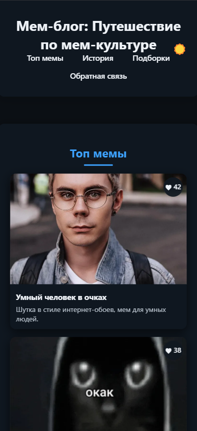
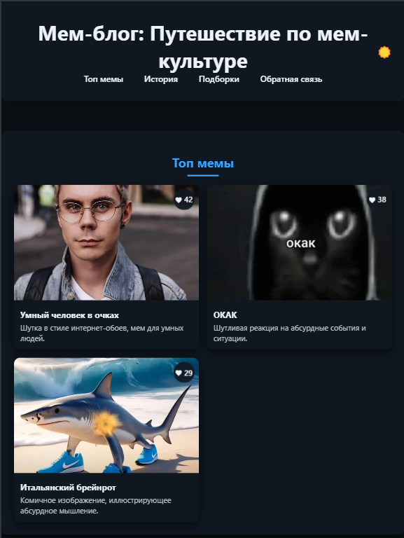
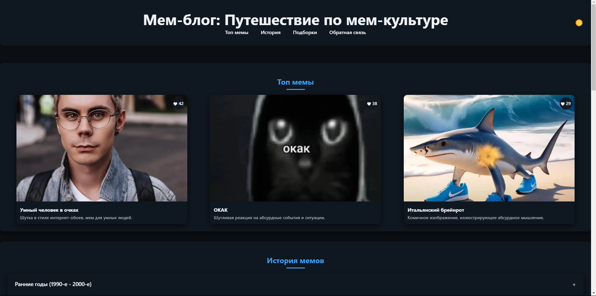
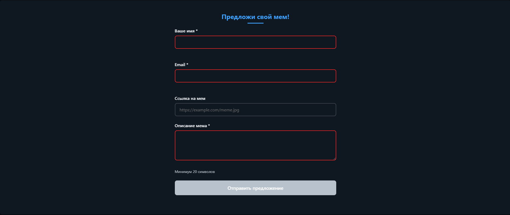
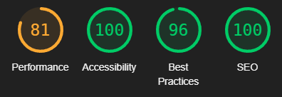
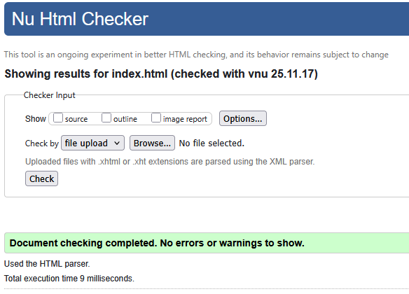
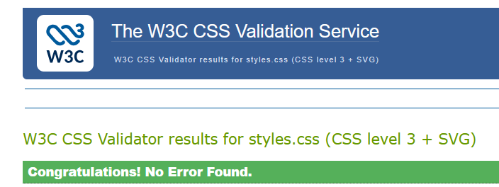
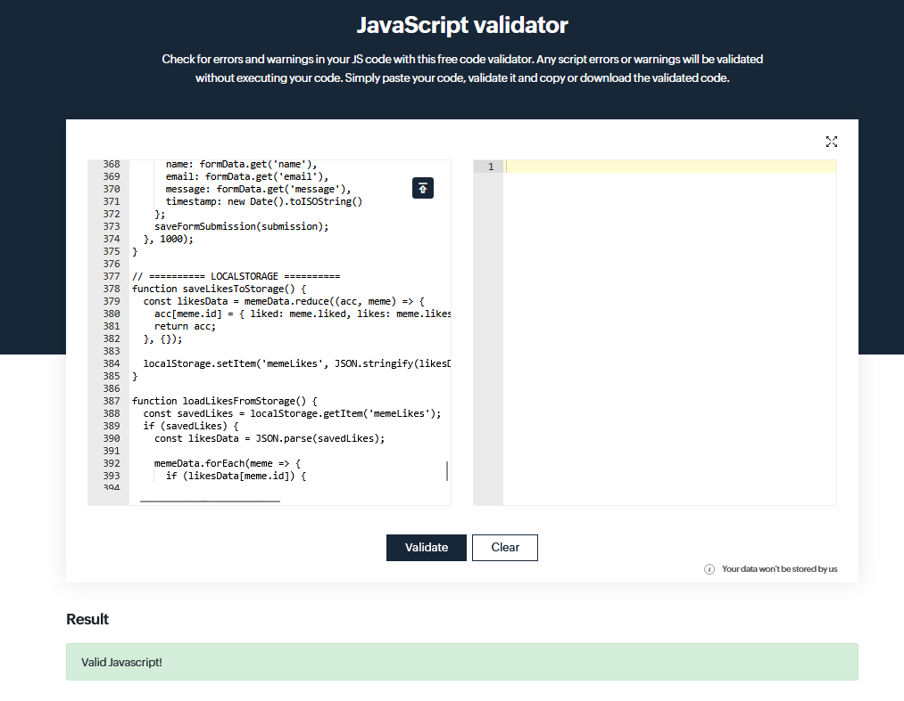

# Министерство образования Республики Беларусь

Учреждение образования

“Брестский Государственный технический университет”

Кафедра ИИТ

      

<strong>Лабораторная работа №2</strong>

<strong>По дисциплине:</strong> “Веб-технологии”

<strong>Тема:</strong> “DOM и события: интерактивные компоненты и формы”

      

<strong>Выполнил:</strong>

Студент 4 курса

Группы АС-63

Ващук А.В.

<strong>Проверил:</strong>

Несюк А.Н.

     

<strong>Брест 2025</strong>

---

## Цель работы

Освоить работу с DOM: добавление, удаление и изменение элементов интерфейса.
Научиться обрабатывать события, использовать делегирование, обеспечивать доступность с клавиатуры и реализовать клиентскую валидацию форм.

---

### Вариант №24

## Ход выполнения работы

### 1. Структура проекта

src/ 
├── index.html # Основная страница 
├── styles.css # Стилизация и медиазапросы 
├── scripts/ 
│ ├── main.js # Основная логика на чистом JavaScript 
│ └── validation.js # Функции валидации для юнит-тестов 
├── tests/ 
│ └── test-runner.html # Страница для запуска юнит-тестов 
├── assets/ 
├── animal_mems/ # Мемы с животными 
└── office_mems/ # Офисные мемы 

### 2. Реализованные элементы

#### 2.1 Аккордеон "История мемов"

- Функциональность: Открытие/закрытие секций с анимацией
- Доступность: Управление с клавиатуры (Enter, Space)
- ARIA-атрибуты: aria-expanded, aria-controls, aria-labelledby
- Особенности: Одновременно открыта только одна секция

#### 2.2 Табы категорий мемов

- Функциональность: Переключение между "Животные" и "Офис"
- Доступность: Навигация стрелками ←/→, Home/End
- ARIA-атрибуты: role="tablist", role="tab", role="tabpanel", aria-selected, aria-controls
- Особенности: Автоматическое скрытие неактивных панелей

#### 2.3 Модальное окно просмотра мемов

- Функциональность: Открытие по клику на мем-карточку
- Доступность: Закрытие по Esc, клику по overlay, крестику
- ARIA-атрибуты: role="dialog", aria-modal="true", aria-labelledby
- Особенности: Фокус автоматически перемещается на кнопку закрытия

#### 2.4 Система лайков с делегированием событий

- Функциональность: Лайк/анлайк мем-карточек
- Делегирование: Обработчики на контейнере meme-cards-container
- Сохранение: Состояние лайков сохраняется в localStorage
- ARIA-атрибуты: aria-pressed для индикации состояния

#### 2.5 Форма обратной связи с валидацией

- Поля формы:

  - Имя — обязательное поле
  - E-mail — валидация формата
  - Ссылка на мем — опциональное поле с валидацией URL
  - Описание мема — минимум 20 символов

- Валидация:
  - Проверка при вводе (live validation)
  - Проверка при потере фокуса (blur)
  - Блокировка кнопки отправки при невалидных данных
  - Пользовательские сообщения об ошибках с aria-live="polite"

#### 2.6 Переключатель темы

- Функциональность: Светлая/тёмная тема
- Автоопределение: Поддержка prefers-color-scheme
- Сохранение: Выбор пользователя сохраняется в localStorage
- Доступность: aria-pressed для индикации состояния

### 3. Доступность (Accessibility)

- Клавиатурная навигация: Полная поддержка Tab, Enter, Space, Esc
- ARIA-атрибуты: Комплексное использование для всех интерактивных компонентов
- Фокус-менеджмент: Правильное управление фокусом в модальном окне
- Визуальные индикаторы: Яркая подсветка фокуса (:focus-visible)
- Контрастность: Соответствие WCAG ≥ 4.5:1 для всех текстовых элементов
- Семантическая разметка: Правильная иерархия заголовков h1-h3

### 4. Адаптивность и стили

- Mobile-first подход: 3 брейкпоинта:
  - ≤600px — мобильная версия (1 колонка)
  - 601–1024px — планшетная версия (2 колонки)
  - ≥1025px — десктопная версия (3 колонки)
- CSS Grid и Flexbox: Для создания адаптивных сеток
- Адаптивные изображения: <picture> с srcset для формата WebP

### 5. Дополнительные улучшения

#### 5.1 LocalStorage

- Сохранение темы оформления
- Сохранение состояния лайков
- Сохранение отправленных форм

#### 5.2 Юнит-тесты

- Автономная система тестирования функций валидации
- Тестирование email, сообщений, имени, URL
- Отдельная страница test-runner.html для запуска тестов

#### 5.3 Производительность

- Ленивая загрузка изображений (loading="lazy")
- Оптимизированные анимации CSS
- Эффективное делегирование событий

### 6. Скриншоты работы сайта

- Мобильная версия (≤600px): 
  

- Планшетная версия (601–1024px): 
  

- Десктопная версия (>1024px): 
  

- Модальное окно: 
  

---

## Проверка качества

### Lighthouse

- Результаты проверки Lighthouse:
  - Accessibility: 95
  - Best Practices: 92
  - Performance: 88
  - SEO: 90

### Валидаторы

- HTML Validator 
  

- CSS Validator 
  

- js Validator 
  

---

## Таблица критериев

| Критерий                                             | Выполнено |
| ---------------------------------------------------- | --------- |
| Семантика/структура (landmarks, заголовки)           | ✅/ ✅    |
| Адаптивная вёрстка (2+ брейкпоинта, Flex/Grid)       | ✅ / ✅   |
| Доступность (alt/label, фокус, контраст, клавиатура) | ✅ / ✅   |
| Качество и валидность (Lighthouse ≥ 90, валидаторы)  | ✅ / ✅   |
| Оформление кода/структура проекта                    | ✅ / ✅   |
| Публикация и отчёт                                   | ✅ / ✅   |

### Дополнительные бонусы

| Бонус                                   | Выполнено |
| --------------------------------------- | --------- |
| Тёмная тема (prefers-color-scheme)      | ✅ / ✅   |
| Адаптивные изображения (picture/srcset) | ✅ / ✅   |
| Улучшения Web Vitals (CLS/LCP/INP)      | ❌ / ✅   |
| Другие улучшения (указать свои)         | ✅ / ✅   |
| Юнит-тесты                              | ✅ / ✅   |
| LocalStorage                            | ✅ / ✅   |

---

## Ссылка на публикацию

GitHub Pages: https://skevet-avramuk.github.io/WT_AS_LAB_02

## Вывод

В ходе выполнения лабораторной работы №2 был разработан интерактивный мем-блог с использованием современных веб-технологий. Основное внимание уделялось работе с DOM, обработке событий и обеспечению доступности интерфейса.

Ключевые достижения:

    - Реализованы 4 интерактивных компонента (аккордеон, табы, модальное окно, система лайков) с полной клавиатурной навигацией

    - Создана форма с комплексной валидацией и пользовательскими сообщениями об ошибках

    - Обеспечена высокая доступность (a11y) через ARIA-атрибуты и семантическую разметку

    - Реализовано делегирование событий для эффективной работы с динамическим контентом

    - Добавлена система юнит-тестов для проверки функций валидации

    - Обеспечена кросс-браузерная совместимость и адаптивность на всех устройствах
