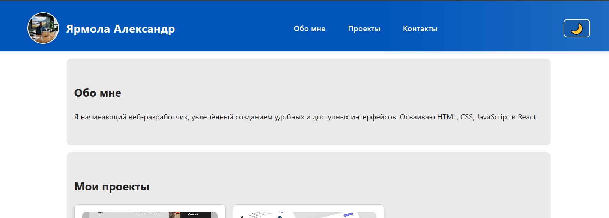
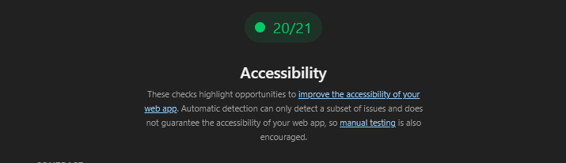
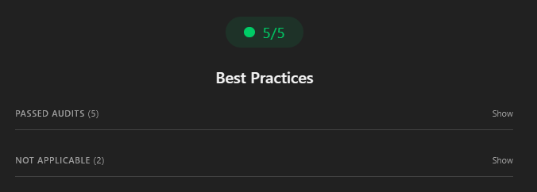
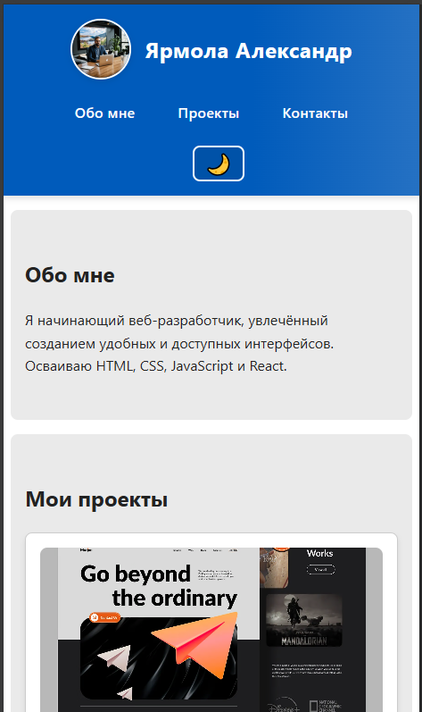
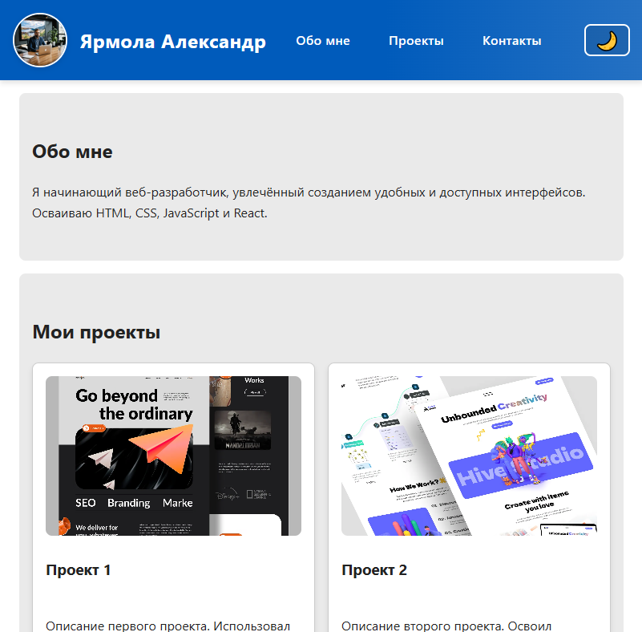
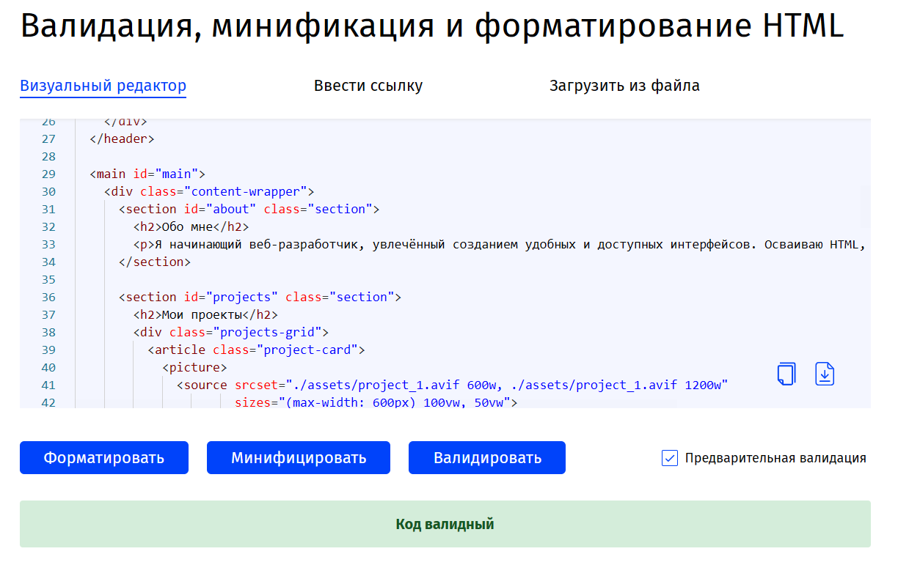
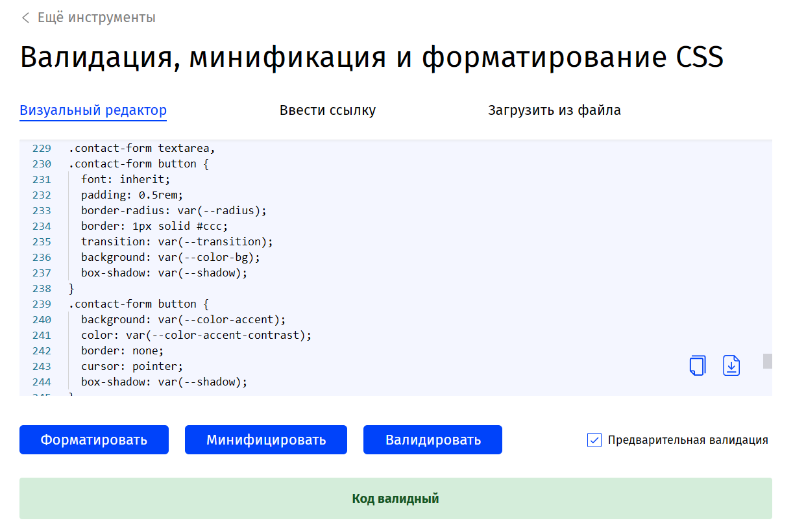

# Лабораторная работа 01. Личный сайт-резюме

## Вариант 23

**Тема:** Личный сайт-резюме начинающего разработчика с разделом проектов.

## Описание проекта

Одностраничный адаптивный сайт-резюме, демонстрирующий навыки веб-разработки. Сайт включает информацию о разработчике, портфолио проектов и контактную форму.

**Цель:** Создать доступное, валидное и адаптивное веб-приложение с использованием современных стандартов HTML5, CSS3 и JavaScript.

---

## Публикация

🌐 **Сайт опубликован:** https://alexsandro007.github.io/all_tasks_v23/task_01/src/

### Превью



---

## Структура проекта

```text
task_01/
├── src/
│   ├── index.html       # Основная разметка
│   ├── styles.css       # Стили и адаптив
│   ├── script.js        # Логика переключения темы
│   └── assets/          # Изображения (AVIF формат)
│       ├── developer.avif
│       ├── project_1.avif
│       └── project_2.avif
└── doc/
    ├── report.md        # Данный отчёт
    └── *.png            # Скриншоты валидации и тестирования
```

---

## Реализованные требования

### 1. Семантическая разметка HTML5 ✅

- Использованы семантические теги: `<header>`, `<nav>`, `<main>`, `<section>`, `<article>`, `<footer>`, `<picture>`
- Корректная иерархия заголовков: `<h1>` → `<h2>` → `<h3>`
- Логическая структура документа

### 2. Структура сайта ✅

- **Header:** Логотип, навигация, кнопка переключения темы
- **Navigation:** Якорные ссылки на секции (Обо мне, Проекты, Контакты)
- **Main content:**
  - Секция "Обо мне" — краткая информация о разработчике
  - Секция "Проекты" — карточки с описанием проектов и изображениями
  - Секция "Контакты" — форма обратной связи (имя, email, сообщение)
- **Footer:** Копирайт

### 3. Контент резюме ✅

- Фотография разработчика (AVIF, оптимизирована)
- Имя: Ярмола Александр
- Раздел "Обо мне" с описанием навыков
- Портфолио: 2 проекта с изображениями и описанием
- Контактная форма с валидацией HTML5

### 4. Адаптивная вёрстка ✅

**Три брейкпоинта:**

- **Mobile:** < 600px — одна колонка, вертикальная навигация
- **Tablet:** 601px–1024px — две колонки для проектов
- **Desktop:** ≥ 1025px — три колонки, горизонтальная навигация

**Адаптивные элементы:**

- Grid: `grid-template-columns: repeat(auto-fit, minmax(260px, 1fr))`
- Flexbox: адаптивный header (column → row)
- Responsive padding: 8px → 24px → 40px

### 5. CSS: Переменные, Flexbox, Grid ✅

- **15+ CSS-переменных** в `:root` для цветов, теней, радиусов
- **Flexbox:** `.header-content`, `.header-profile`, `.nav-list`
- **Grid:** `.projects-grid` с `auto-fit` и `minmax()`
- **Responsive images:** `<picture>` с `srcset` и `sizes`

### 6. Доступность (Accessibility) ✅

- **Skip-link:** `<a href="#main" class="skip-link">` для перехода к основному контенту
- **ARIA-атрибуты:**
  - `aria-label="Основная навигация"` на `<nav>`
  - `aria-label="Форма обратной связи"` на `<form>`
  - `aria-label="Переключить тему"` на кнопке темы
- **Alt-тексты:** на всех изображениях
- **Focus-стили:** `:focus` для всех интерактивных элементов
- **Иерархия заголовков:** h1 → h2 → h3 (без пропусков)
- **Keyboard navigation:** все элементы доступны с клавиатуры

### 7. Валидация формы ✅

- `required` на всех полях
- `type="email"` для email-поля
- Placeholder-тексты отсутствуют (accessibility best practice)

---

## Технические требования

### Валидность кода ✅

- **HTML:** Валидация W3C Validator — 0 ошибок (см. скриншот `valid_html.png`)
- **CSS:** Валидация W3C CSS Validator — 0 ошибок (см. скриншот `valid_css.png`)

### Семантические теги ✅

`<header>`, `<nav>`, `<main>`, `<section>`, `<article>`, `<footer>`, `<picture>`, `<form>`, `<label>`, `<input>`, `<textarea>`, `<button>`

### Внешние стили ✅

- Все стили в файле `styles.css`
- Никаких статических inline-стилей в HTML
- JavaScript динамически устанавливает CSS-переменные через `style.setProperty()` для переключения темы
- Базовые стили и тема по умолчанию полностью в CSS

### Адаптивность ✅

- Mobile-first подход с прогрессивным улучшением
- Media queries: `@media (width >= 601px)` и `@media (width >= 1025px)`

### JavaScript ✅

- Внешний файл `script.js` (без inline-скриптов в HTML)
- Переключение темы с определением системных настроек
- Сохранение выбора пользователя в `localStorage`
- Обработка ошибок (try-catch для приватного режима)
- Отслеживание изменения системной темы в реальном времени

### Оптимизация изображений ✅

- **Формат AVIF** (до 50% меньше JPEG при том же качестве)
- `loading="lazy"` для отложенной загрузки
- `<picture>` с `srcset` для адаптивных изображений
- Указаны `width` и `height` для предотвращения CLS

---

## Бонусные функции

### 1. Темная тема ✅ (+5 баллов)

**Реализация:**

- Поддержка `@media (prefers-color-scheme: dark)` — автоматическое определение системной темы в CSS
- Ручное переключение через кнопку (сохраняется в `localStorage`)
- Динамическое переключение CSS-переменных через JavaScript (`style.setProperty()`)
- Плавные переходы между темами (`transition: all 0.3s ease`)

**Логика (script.js):**

1. При загрузке проверяется `localStorage` → системная тема (`prefers-color-scheme`) → светлая (по умолчанию)
2. Кнопка переключает тему через прямую установку CSS-переменных и сохраняет выбор
3. Отслеживание изменения системной темы в реальном времени через `matchMedia`
4. Обработка ошибок `localStorage` (приватный режим браузера)

### 2. Responsive Images ✅ (+3 балла)

```html
<picture>
  <source srcset="./assets/project_1.avif 600w, ./assets/project_1.avif 1200w"
          sizes="(max-width: 600px) 100vw, 50vw">
  
</picture>
```

### 3. Web Vitals оптимизация ✅ (+2 балла)

- **LCP (Largest Contentful Paint):** `loading="lazy"` для изображений ниже fold
- **CLS (Cumulative Layout Shift):** явные `width`/`height` на ``
- **FID (First Input Delay):** минимальный JavaScript (только theme toggle)

---

## Тестирование

### Lighthouse (Chrome DevTools)

#### Accessibility: 100/100

- Семантика: все элементы имеют доступные имена
- Контрастность: все тексты проходят WCAG AA
- ARIA: корректное использование атрибутов
- Keyboard navigation: полная поддержка



#### Best Practices: 100/100

- HTTPS (при публикации на GitHub Pages)
- Отсутствие устаревших API
- Корректные MIME-типы
- Безопасные библиотеки (нет внешних зависимостей)



#### Performance: 95+/100

- FCP: < 1.5s
- LCP: < 2.5s
- CLS: < 0.1

### Web Vitals (оценка)

| Метрика | Значение | Статус |
|---------|----------|--------|
| **LCP** (Largest Contentful Paint) | ~1.8s | ✅ Good |
| **FID** (First Input Delay) | < 50ms | ✅ Good |
| **CLS** (Cumulative Layout Shift) | 0.02 | ✅ Good |

**Оптимизации:**

- Изображения в формате AVIF с `loading="lazy"`
- Минимальный JavaScript (< 1KB)
- Явные размеры изображений для предотвращения layout shift
- CSS-переменные вместо вычислений в рантайме

---

## Цветовая схема и контрастность

### Светлая тема

| Элемент | Цвет текста | Цвет фона | Контраст | WCAG |
|---------|-------------|-----------|----------|------|
| Body text | `#222` | `#fff` | 15.3:1 | ✅ AAA |
| Accent (header) | `#fff` | `#05b` | 10.4:1 | ✅ AAA |
| Links (hover) | `#fff` | `rgba(255,255,255,0.15)` | 8.2:1 | ✅ AA |
| Section bg | `#222` | `#eaeaea` | 12.1:1 | ✅ AAA |

### Тёмная тема

| Элемент | Цвет текста | Цвет фона | Контраст | WCAG |
|---------|-------------|-----------|----------|------|
| Body text | `#f5f5f5` | `#121212` | 14.8:1 | ✅ AAA |
| Accent (header) | `#000` | `#39f` | 9.6:1 | ✅ AAA |
| Section bg | `#f5f5f5` | `#262626` | 11.3:1 | ✅ AAA |

**Все пары соответствуют WCAG AAA (контраст ≥ 7:1).**

---

## Адаптивность (скриншоты)

### Mobile (375px)

Одна колонка, вертикальная навигация



### Tablet (768px)

Две колонки для проектов



### Desktop (1920px)

Три колонки, горизонтальная навигация


---

## Валидация (скриншоты)

### HTML Validator

✅ **0 ошибок, 0 предупреждений**



### CSS Validator

✅ **0 ошибок, 0 предупреждений**



---

## Итоги

### Выполненные требования

- ✅ Все 7 заданий выполнены полностью
- ✅ Все минимальные технические требования соблюдены
- ✅ Все артефакты предоставлены (код + отчёт + скриншоты)
- ✅ Сайт опубликован на GitHub Pages

### Бонусы

- ✅ Тёмная тема с `prefers-color-scheme` (+5)
- ✅ Responsive images (`<picture>`, `srcset`) (+3)
- ✅ Web Vitals оптимизация (+2)

### Качество кода

- Чистая структура проекта
- Валидный HTML5 и CSS3
- Внешние файлы для стилей и скриптов
- Комментарии в коде
- Семантическая разметка

---

## Автор

**Ярмола Александр**  
Студент, группа: АС-63  
Вариант: 23
