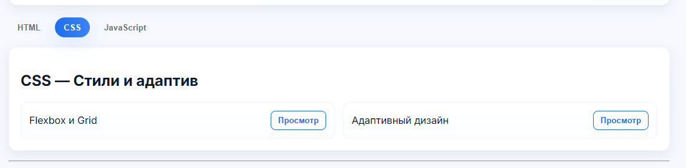
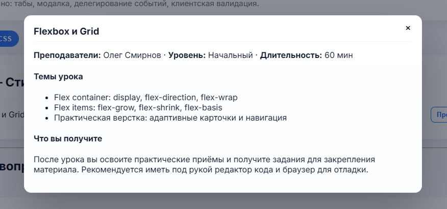
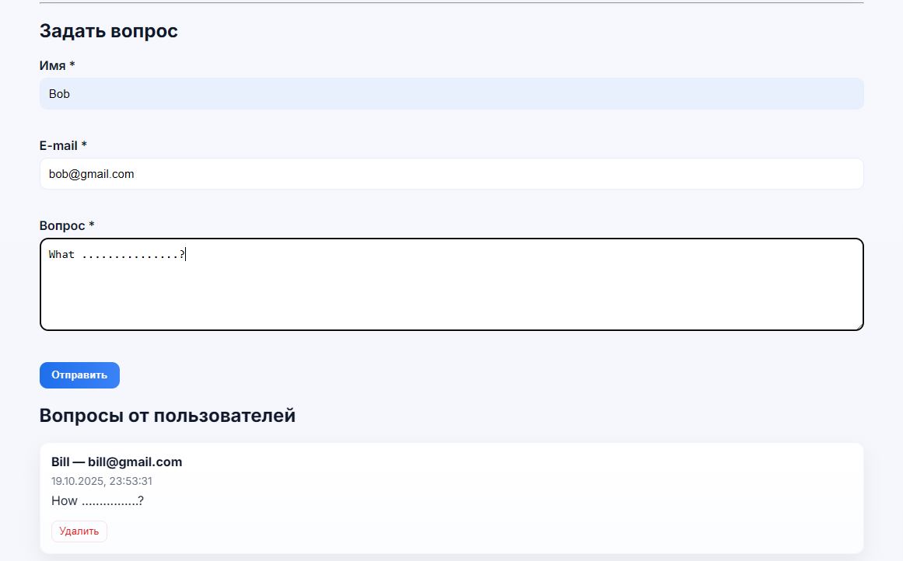
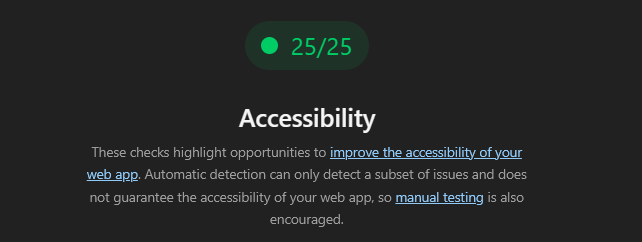
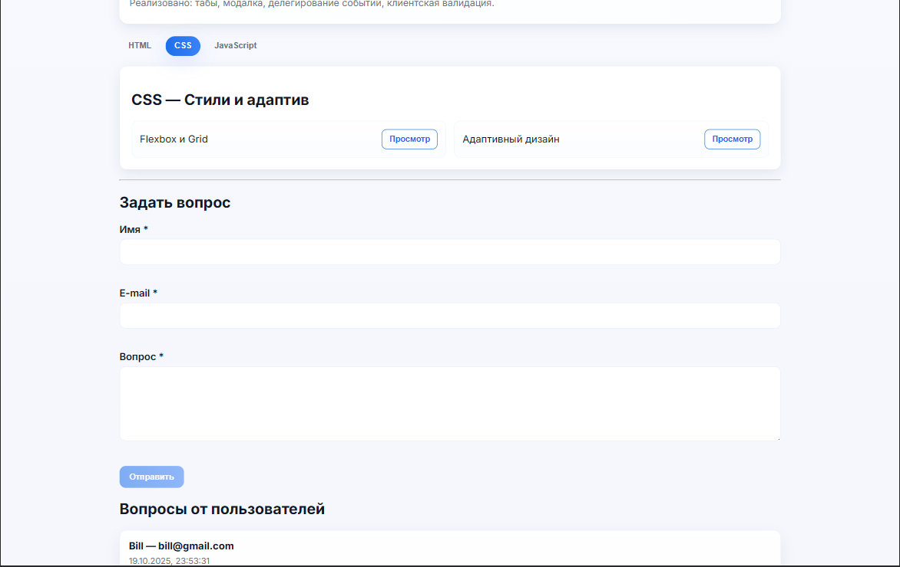
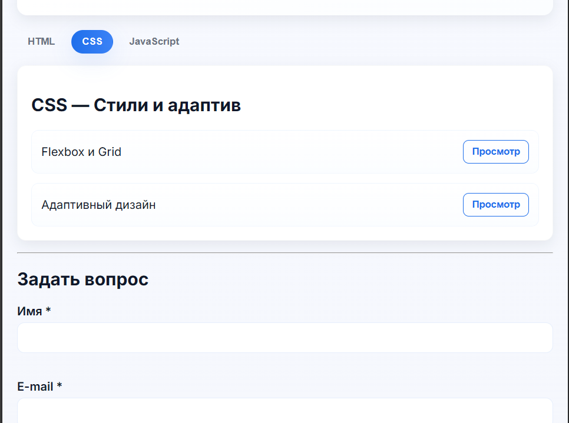
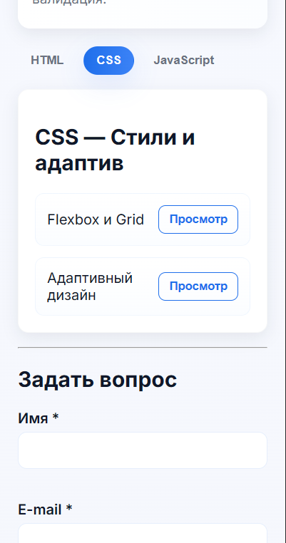
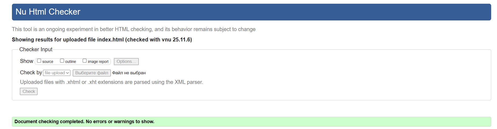
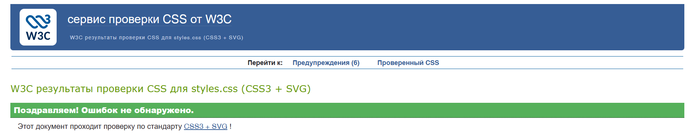
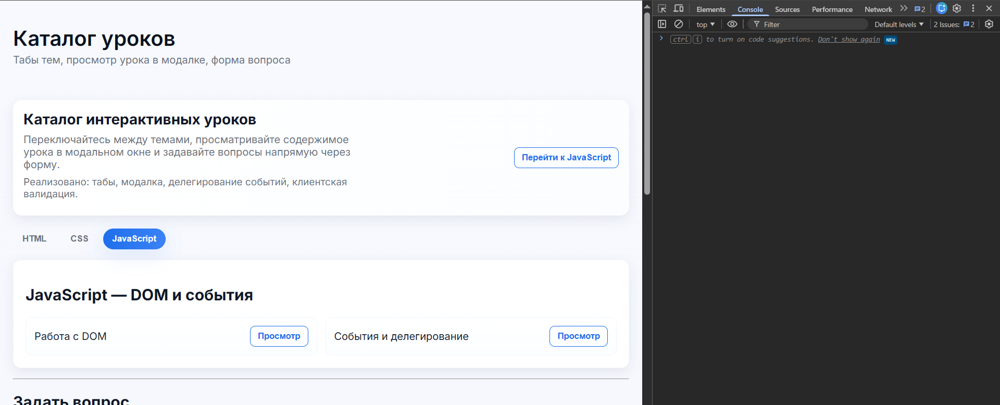

# Отчёт — Вариант 23: Каталог уроков

## Публикация

**Сайт опубликован:** https://alexsandro007.github.io/all_tasks_v23/task_02/src/index.html

---

## Краткое описание

Реализован небольшой SPA‑подобный каталог уроков с тремя основными функциями:

- Табы тем (HTML / CSS / JavaScript) — переключение с поддержкой клавиатуры (стрелки).
- Модалка «Просмотр урока» — открывается по кнопке в списке, управление фокусом и закрытие по Esc/клик вне.
- Форма «Задать вопрос» — клиентская валидация, кнопка отправки активируется только при валидных полях.

Файлы

- `src/index.html` — основной интерфейс.
- `src/styles.css` — стили.
- `src/main.js` — логика табов, модалки и формы.

Инструкция по запуску (локально)

1. Откройте PowerShell.
2. Перейдите в папку `task_02/src`:

```powershell
cd .\students\YarmolaAleksandr\task_02\src
```

1. Откройте `index.html` в браузере двойным кликом или через PowerShell:

```powershell
start .\index.html
```

1. Как проверить работу

- Переключите вкладки — убедитесь, что меняется содержимое панелей и aria‑атрибуты.
- Нажмите «Просмотр» на любом уроке — должна открыться модалка с содержимым, закройте её кнопкой или Esc.
- Заполните форму (имя, email, вопрос минимум 20 символов) — кнопка "Отправить" станет доступна, после отправки появится сообщение.
- Перезагрузите страницу — выбранная вкладка и отправленные вопросы должны восстановиться из localStorage.

## Реализованные требования

### 1. Интерактивные компоненты (3 из 3)

- **Табы** — переключение между темами уроков (HTML/CSS/JavaScript) с поддержкой клавиатуры (стрелки, Home, End, Enter, Space). Используются ARIA-атрибуты: `role="tab"`, `aria-selected`, `aria-controls`, `role="tabpanel"`, `aria-hidden`.
- **Модальное окно** — открытие по кнопке «Просмотр», управление фокусом (фокус переходит в модалку, возвращается на opener при закрытии), закрытие по Esc/клику вне. Атрибуты: `role="dialog"`, `aria-modal="true"`, `aria-hidden`.
- **Форма с валидацией** — поля: имя (required, minlength=2), email (type=email, required), вопрос (required, minlength=20). Валидация при вводе и отправке, пользовательские сообщения об ошибках, кнопка отправки disabled при невалидной форме.

### 2. Делегирование событий

- Обработчики для кнопок «Просмотр» в списках уроков повешены на контейнер `.lessons` (делегирование).
- Обработчик удаления вопросов повешен на контейнер `#questions` (делегирование).

### 3. Доступность (a11y)

- Семантическая разметка: `<header>`, `<main>`, `<section>`, `<nav>`, `<footer>`.
- ARIA-атрибуты для табов, модалки, панелей (aria-selected, aria-controls, aria-hidden, role="tab"/"tabpanel"/"dialog").
- Клавиатурное управление: Tab/Shift+Tab, стрелки для табов, Enter/Space для активации, Esc для закрытия модалки.
- Управление фокусом: фокус переходит в модалку при открытии и возвращается на opener при закрытии; временное отключение фокусируемых элементов внутри скрытой модалки (aria-hidden="true").
- aria-live регионы для динамических сообщений (результат отправки формы).

### 4. Сохранение состояния (бонус)

- Реализовано сохранение выбранной вкладки и списка отправлённых вопросов в localStorage.
  - Ключ для активной вкладки: `lab02_active_tab` (сохраняется id кнопки вкладки, например `tab-2`).
  - Ключ для вопросов: `task02_questions` (массив объектов вопросов в JSON).

  Чтобы очистить состояние при тестировании, откройте инструменты разработчика в браузере (F12) → Console и выполните:

  ```javascript
  localStorage.removeItem('lab02_active_tab');
  localStorage.removeItem('task02_questions');
  ```

  Или очистите весь localStorage командой `localStorage.clear()`.

### 5. Адаптивность

- CSS реализован в mobile-first подходе с брейкпоинтом `@media (min-width: 880px)`.
- Используются относительные единицы (rem, %), flexbox/grid для адаптивной верстки.

## Скриншоты

### Переключение вкладок


*Рисунок 1: Активная вкладка HTML с перечнем уроков*


*Рисунок 2: Переключение на вкладку CSS*

### Модальное окно урока


*Рисунок 3: Открытая модалка с содержимым урока — темы, авторы, длительность*

### Форма и отправка вопроса


*Рисунок 4: Заполненная форма с сообщением об успешной отправке*

### Accessibility



## Адаптивность на разных устройствах

Проект реализован с использованием mobile-first подхода и адаптируется под различные размеры экранов.

### Десктоп


*Рисунок 5: Версия для настольных компьютеров*

### Планшет


*Рисунок 6: Версия для планшетов*

### Мобильный телефон


*Рисунок 7: Мобильная версия*

---

## Валидация и качество кода

### HTML Validator (W3C)

HTML-код проверен через [W3C Markup Validator](https://validator.w3.org/).


*Рисунок 8: Результат валидации HTML — 0 ошибок, 0 предупреждений*

### CSS Validator (W3C)

CSS-код проверен через [W3C CSS Validator](https://jigsaw.w3.org/css-validator/).


*Рисунок 9: Результат валидации CSS — 0 ошибок*

### Консоль браузера

Проверка на отсутствие ошибок JavaScript в консоли браузера.


*Рисунок 10: Консоль браузера без ошибок*
