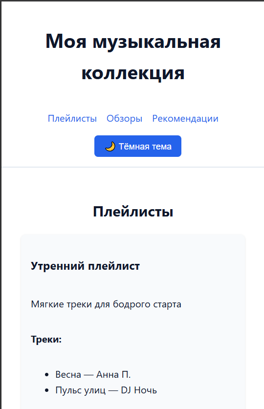
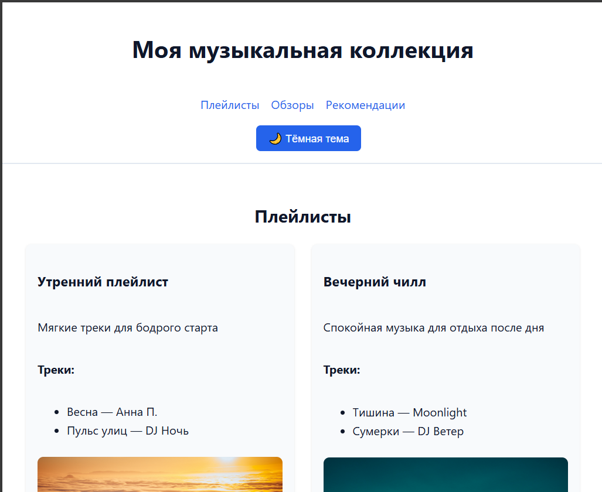
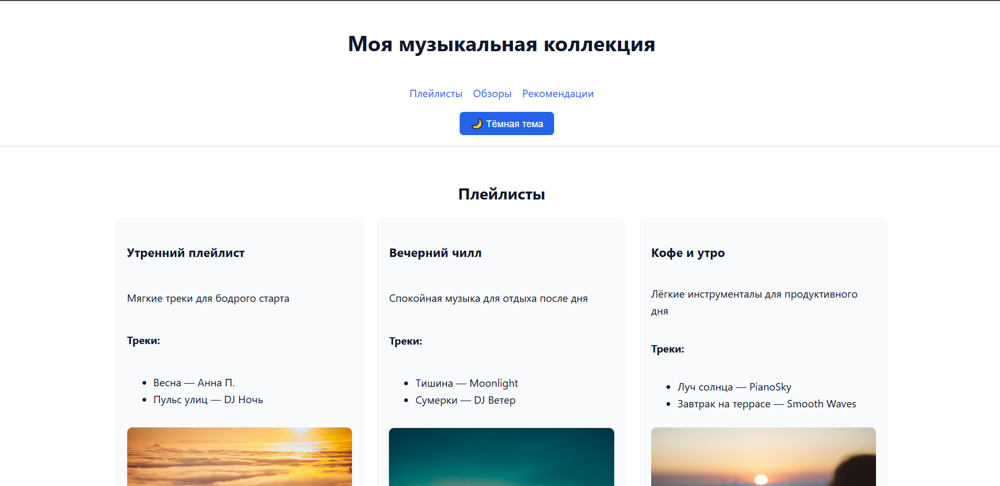
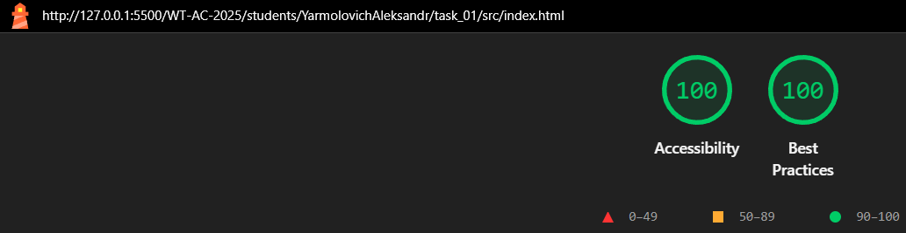
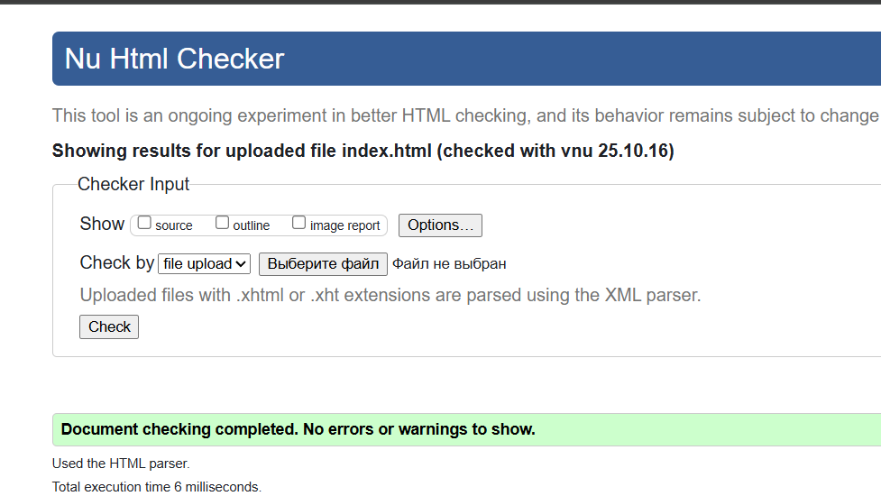
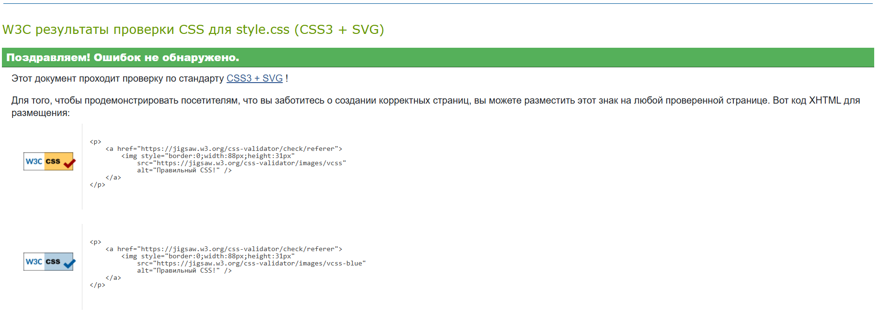

# Министерство образования Республики Беларусь

Учреждение образования

“Брестский Государственный технический университет”

Кафедра ИИТ

      

<strong>Лабораторная работа №1</strong>

<strong>По дисциплине:</strong> “Веб-технологии”

<strong>Тема:</strong> “HTML/CSS: семантика, адаптивность и доступность”

      

<strong>Выполнил:</strong>

Студент 4 курса

Группы АС-63

Ярмоловис А.С.

<strong>Проверил:</strong>

Несюк А.Н.

     

<strong>Брест 2025</strong>

---

## Цель работы

Освоить основы семантической вёрстки HTML5, реализовать адаптивную структуру веб-страницы по принципу **mobile-first** и обеспечить её доступность в соответствии с современными стандартами.

---

### Вариант №24

## Ход выполнения работы

### 1. Структура проекта

- `index.html` — основная страница
- `styles.css` — стилизация и медиазапросы
- `assets/` — изображения и дополнительные материалы

### 2. Реализованные элементы

#### Семантическая структура

- Использованы семантические теги **HTML5**: `header`, `nav`, `main`, `section`, `article`, `aside`, `footer`.
- Структура страницы логична и соответствует назначению контента.

#### Доступность (Accessibility)

- Добавлены атрибуты **`aria-label`**, **`aria-labelledby`** для улучшения восприятия контента скринридерами.
- У интерактивных элементов есть **`tabindex`** и видимая **подсветка фокуса**.
- Все изображения содержат корректные **`alt`**-тексты.
- Цветовая палитра обеспечивает контрастность **≥ 4.5:1**.

#### Адаптивная вёрстка

- Реализована **CSS Grid-сетка** с медиазапросами для разных устройств:
  - до **600px** — 1 колонка (мобильная версия)
  - **601–1024px** — 2 колонки (планшетная версия)
  - от **1025px** — 3 колонки (десктоп)
- Использован **mobile-first** подход — стили для мобильных устройств заданы по умолчанию.

#### Темы оформления

- Поддержка **тёмной и светлой темы** через переключатель (`button`) и сохранение выбора в **localStorage**.
- Используется системная настройка цвета (`prefers-color-scheme`).
- Цветовые схемы реализованы с помощью **CSS-переменных** (`--bg`, `--fg`, `--accent` и др.).

#### Анимации и переходы

- Плавные эффекты при наведении и фокусе (`transition`, `transform`).
- Анимация масштабирования изображений и карточек при наведении курсора.

#### Интерактивные элементы

- Кнопка для смены темы оформления.
- Навигационное меню с hover- и focus-состояниями.
- Элементы списка рекомендаций интерактивны (доступны через клавиатуру).

#### Работа с изображениями

- Использованы теги **`<picture>`** и **`srcset`** для адаптивной загрузки изображений.
- Все изображения имеют корректные подписи и описания.

### 3. Скриншоты работы сайта

👉 Вставьте сюда 3 скриншота:

- Мобильная версия (≤600px):

- Планшетная версия (601–1024px):

- Десктопная версия (>1024px):

---

## Проверка качества

### Lighthouse

👉 Вставьте результаты проверки Lighthouse (Accessibility, Best Practices ≥ 90):

### Валидаторы

👉Вставьте результаты проверок:

- HTML Validator

- CSS Validator

---

## Таблица критериев

| Критерий                                | Выполнено |
|------------------------------------------|-----------|
| Семантика/структура (landmarks, заголовки) | ✅/ ✅ |
| Адаптивная вёрстка (2+ брейкпоинта, Flex/Grid) | ✅ / ✅ |
| Доступность (alt/label, фокус, контраст, клавиатура) | ✅ / ✅ |
| Качество и валидность (Lighthouse ≥ 90, валидаторы) | ✅ / ✅ |
| Оформление кода/структура проекта        | ✅ / ✅ |
| Публикация и отчёт                       | ✅ / ✅ |

### Дополнительные бонусы

| Бонус                                     | Выполнено |
|-------------------------------------------|-----------|
| Тёмная тема (prefers-color-scheme)        | ✅ / ✅ |
| Адаптивные изображения (picture/srcset)   | ✅ / ✅ |
| Улучшения Web Vitals (CLS/LCP/INP)        | ✅ / ✅ |
| Другие улучшения (указать свои)           | ✅ / ✅ |

---

## Ссылка на публикацию

👉 Вставьте ссылку на GitHub Pages: https://yarmolov.github.io/my_musical_collection/

## Вывод

В ходе работы была создана адаптивная веб-страница «Моя музыкальная коллекция», оформленная с применением современных подходов к вёрстке. Были использованы семантические теги HTML5, реализована адаптивность через CSS Grid и медиа-запросы, обеспечена доступность интерфейса за счёт alt-текстов, aria-атрибутов и фокуса клавиатурой. Добавлена поддержка тёмной темы с помощью CSS-переменных и JavaScript-переключателя, а также адаптивные изображения с использованием <picture> и srcset. В процессе освоены навыки семантической и адаптивной вёрстки, работы с переменными CSS, принципов доступности (a11y) и оптимизации пользовательского интерфейса под разные устройства.
