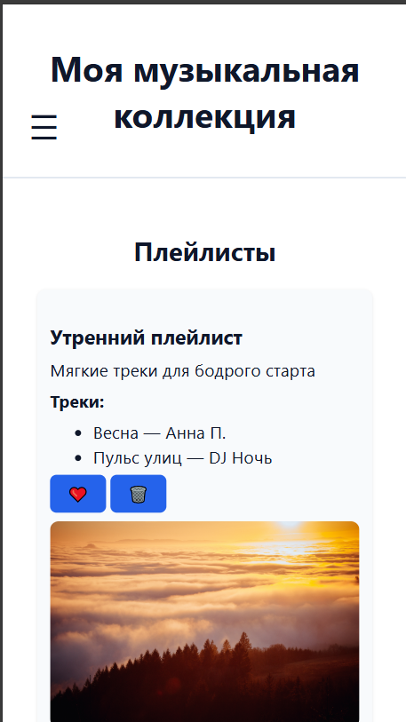
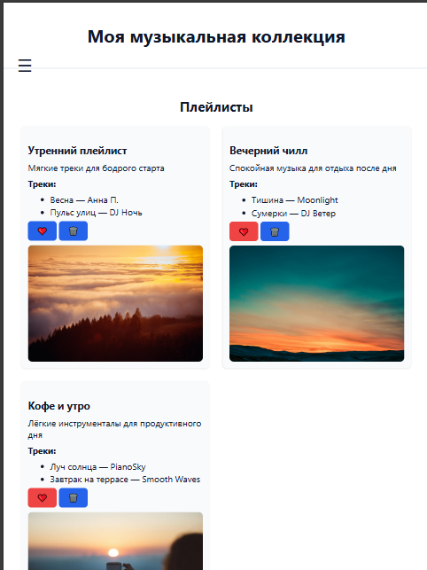
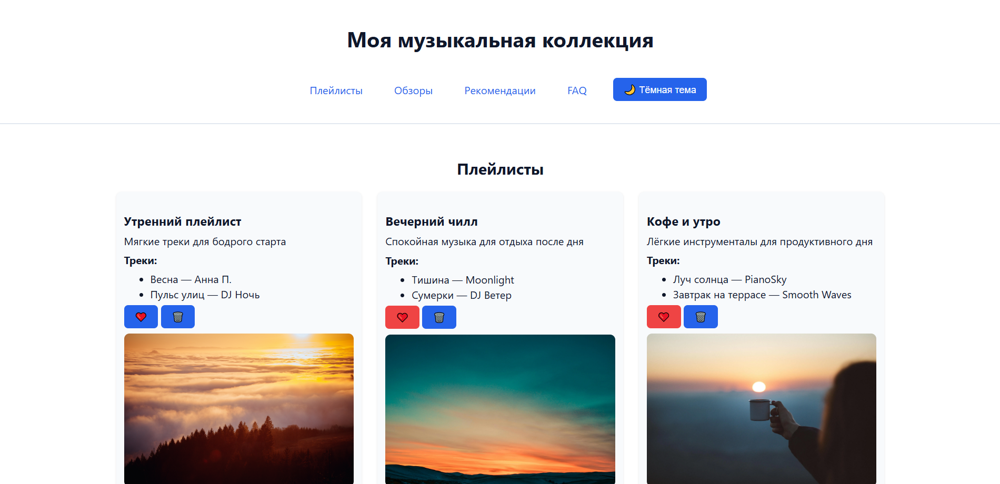
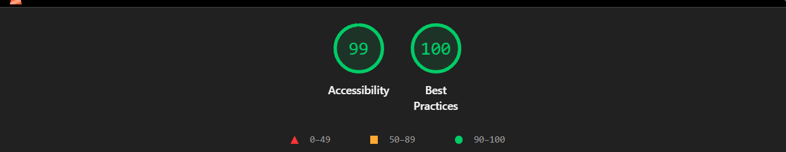
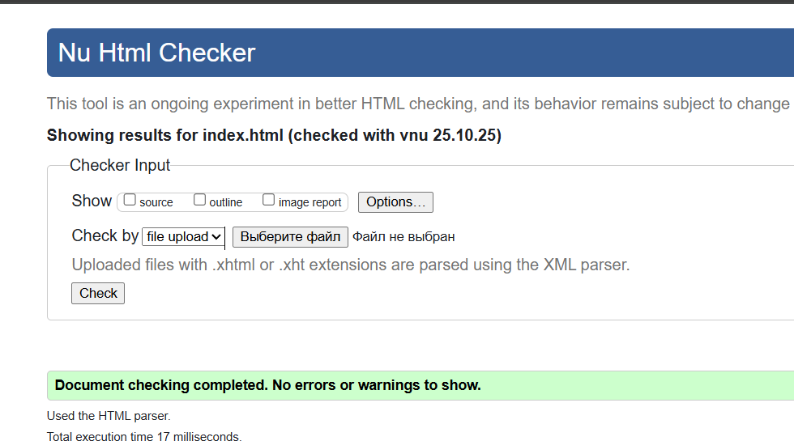
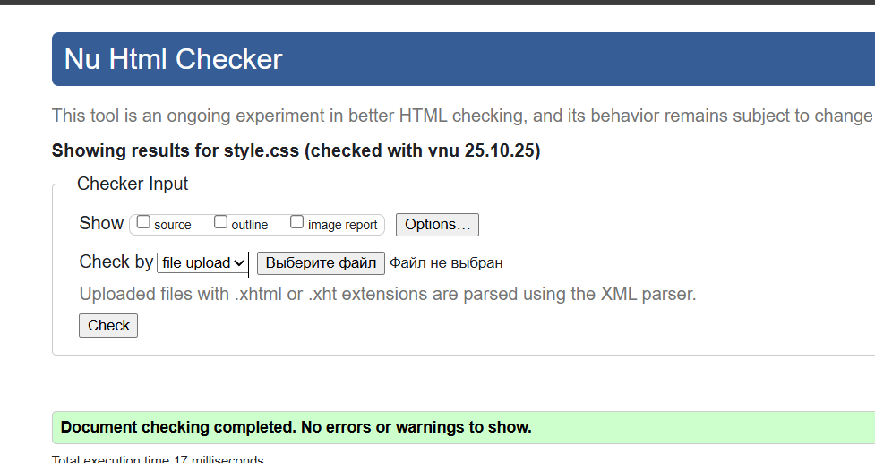

# Министерство образования Республики Беларусь

Учреждение образования

“Брестский Государственный технический университет”

Кафедра ИИТ

      

<strong>Лабораторная работа №2</strong>

<strong>По дисциплине:</strong> “Веб-технологии”

<strong>Тема:</strong> “DOM и события: интерактивные компоненты и формы”

      

<strong>Выполнил:</strong>

Студент 4 курса

Группы АС-63

Ярмоловис А.С.

<strong>Проверил:</strong>

Несюк А.Н.

     

<strong>Брест 2025</strong>

---

## Цель работы

Освоить работу с DOM: добавление, удаление и изменение элементов интерфейса.
Научиться обрабатывать события, использовать делегирование, обеспечивать доступность с клавиатуры и реализовать клиентскую валидацию форм.

---

### Вариант №24

## Ход выполнения работы

### 1. Структура проекта

- `index.html` — основная страница
- `styles.css` — стилизация и медиазапросы
- `main.js` — логика на чистом js
- `assets/` — изображения и дополнительные материалы

### 2. Реализованные элементы

#### Аккордеон

- Открытие и закрытие секций с клавиатуры (Enter, Space)
- Использование атрибутов `aria-expanded`, `aria-controls`

#### Модальное окно

- Открытие по кнопке
- Закрытие по Esc
- Фокус-трап внутри модалки

#### Табы (вкладки)

- Переключение Tab/Tab+Shit и Enter
- Использование `role="tablist"`, `aria-selected`, `aria-controls`

#### Делегирование событий

- Список карточек с кнопками «Лайк» и «Удалить»
- Обработчики событий навешаны на контейнер списка

#### Работа с формой

#### Поля

- Имя — обязательное
- E-mail — валидный формат
- Сообщение — минимум 20 символов

#### Проверка

- Выполняется при вводе и при отправке
- Отображаются пользовательские сообщения об ошибках
- Кнопка отправки активируется только при валидных данных
- При отправке форма не обновляет страницу, а отображает результаn в модальном окне

#### Доступность (Accessibility)

- Управление компонентами с клавиатуры (Tab, Enter, Space, Esc)
- Добавлены ARIA-атрибуты для модалки, аккордеона и табов
- Видимая подсветка фокуса для всех интерактивных элементов
- Контраст текста соответствует уровню WCAG ≥ 4.5:1

#### Адаптивность и стили

- Mobile-first подход с медиазапросами:
  - до 600px — мобильная версия
  - 601–1024px — планшетная
  - от 1025px — десктоп
- Использованы Flexbox и Grid для позиционирования

#### Дополнительные улучшения

- Сохранение состояния (открытые вкладки, тема) через localStorage
- Поддержка тёмной темы через переключатель темы

### 3. Скриншоты работы сайта

👉 Вставьте сюда 3 скриншота:

- Мобильная версия (≤600px):

- Планшетная версия (601–1024px):

- Десктопная версия (>1024px):

---

## Проверка качества

### Lighthouse

👉 Вставьте результаты проверки Lighthouse (Accessibility, Best Practices ≥ 90):

### Валидаторы

👉Вставьте результаты проверок:

- HTML Validator

- CSS Validator

---

## Таблица критериев

| Критерий                                | Выполнено |
|------------------------------------------|-----------|
| Семантика/структура (landmarks, заголовки) | ✅/ ✅ |
| Адаптивная вёрстка (2+ брейкпоинта, Flex/Grid) | ✅ / ✅ |
| Доступность (alt/label, фокус, контраст, клавиатура) | ✅ / ✅ |
| Качество и валидность (Lighthouse ≥ 90, валидаторы) | ✅ / ✅ |
| Оформление кода/структура проекта        | ✅ / ✅ |
| Публикация и отчёт                       | ✅ / ✅ |

### Дополнительные бонусы

| Бонус                                     | Выполнено |
|-------------------------------------------|-----------|
| Тёмная тема (prefers-color-scheme)        | ✅ / ✅ |
| Адаптивные изображения (picture/srcset)   | ✅ / ✅ |
| Улучшения Web Vitals (CLS/LCP/INP)        | ❌ / ✅ |
| Другие улучшения (указать свои)           | ❌ / ✅ |

---

## Ссылка на публикацию

👉 Вставьте ссылку на GitHub Pages: https://yarmolov.github.io/my_musical_collection/

## Вывод

В ходе работы была создана адаптивная веб-страница «Моя музыкальная коллекция», оформленная с применением современных подходов к вёрстке. Были использованы семантические теги HTML5, реализована адаптивность через CSS Grid и медиа-запросы, обеспечена доступность интерфейса за счёт alt-текстов, aria-атрибутов и фокуса клавиатурой. Добавлена поддержка тёмной темы с помощью CSS-переменных и JavaScript-переключателя, а также адаптивные изображения с использованием <picture> и srcset. В процессе освоены навыки семантической и адаптивной вёрстки, работы с переменными CSS, принципов доступности (a11y) и оптимизации пользовательского интерфейса под разные устройства.
