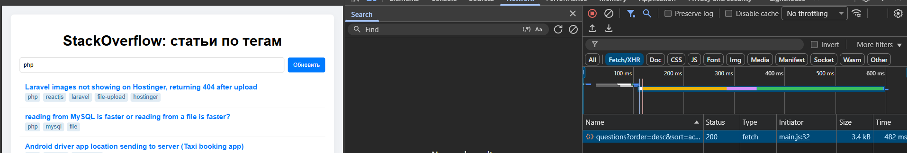
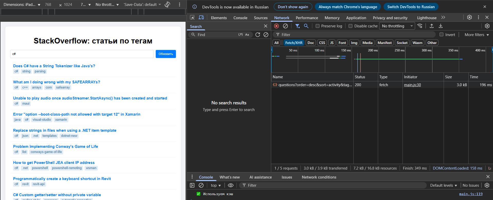
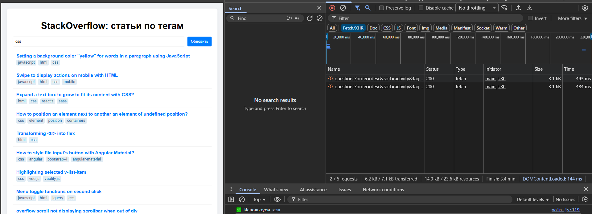
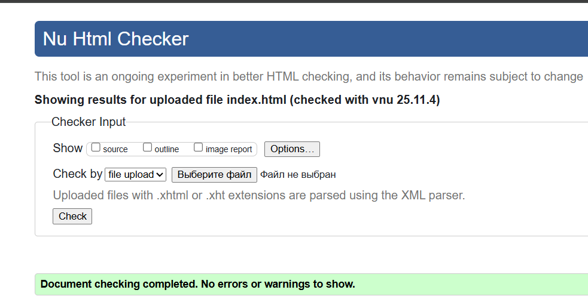

# Министерство образования Республики Беларусь

<p align="center">Учреждение образования</p>
<p align="center">“Брестский Государственный технический университет”</p>
<p align="center">Кафедра ИИТ</p>
<br><br><br><br><br><br>
<p align="center"><strong>Лабораторная работа №3</strong></p>
<p align="center"><strong>По дисциплине:</strong> “Веб-технологии”</p>
<p align="center"><strong>Тема:</strong> “Асинхронность и HTTP‑кэш (fetch, AbortController, ретраи)”</p>
<br><br><br><br><br><br>
<p align="right"><strong>Выполнил:</strong></p>
<p align="right">Студент 4 курса</p>
<p align="right">Группы АС-63</p>
<p align="right">Ярмоловис А.С.</p>
<p align="right"><strong>Проверил:</strong></p>
<p align="right">Несюк А.Н.</p>
<br><br><br><br><br>
<p align="center"><strong>Брест 2025</strong></p>

---

## Цель работы

* Закрепить работу с промисами и async/await, обработкой ошибок, таймаутами и отменой запросов.
* Понять основы HTTP‑кэширования и увидеть эффект в DevTools.

---

### Вариант №24

## Ход выполнения работы

### 1. Структура проекта

- `index.html` — основная страница
- `styles.css` — стилизация
- `main.js` — логика на чистом js

### 2. Описание кэш‑подхода

#### 2.1 Тип кэша

В проекте используется in-memory Map:

```bash
const cache = new Map();
```

Ключ кэша формируется как:

```bash
const cache = new Map();
```

То есть комбинация текущая страница + тег, что позволяет отдельно кэшировать данные каждой страницы и каждого тега.

Значение кэша — объект:

```bash
{data: items, time: now}
```

Где items — массив вопросов, time — время записи (Date.now()).

#### 2.2 TTL

Для каждой записи используется TTL:

```bash
const TTL = 60_000; 
```

При загрузке данных проверяется, не устарела ли запись:

```bash
if (!force && cache.has(key) && now - cache.get(key).time < TTL) {
    renderData(cache.get(key).data, prefetch);
    return;
}
```

#### 2.3 Принудительное обновление

Кнопка «Обновить» игнорирует кэш:

```bash
refreshBtn.addEventListener("click", () => {
  loadData(true);
});
```

Параметр force = true заставляет fetch выполнить запрос к API даже при наличии свежего кэша.

#### 2.4 Поведение в DevTools / сети

* Первый запрос страницы с тегом → HTTP-запрос → 200 OK → данные сохраняются в Map.
* Повторный запрос того же ключа → данные берутся из Map, сетевой запрос не отправляется.
* Нажатие «Обновить» → игнорирует кэш → новый сетевой запрос → Map перезаписывается свежими данными.

#### 2.5 Преимущества подхода

* Ускоряет повторный рендер одинаковых данных.
* Уменьшает сетевой трафик и нагрузку на API.
* Позволяет легко контролировать устаревание данных через TTL.
* Простая реализация — не требует дополнительной инфраструктуры.

### 3. Скриншоты DevTools (первый/повторный запрос)

- Первый запрос:
  

- Повторный запрос:
  

 Повторный запрос:
  

### Валидаторы

👉Вставьте результаты проверок:

- HTML Validator


- CSS Validator


---

### 4. Описание ретраев/таймаутов/отмены

#### 4.1 Описание ретраев

Retry — повтор запросов при ошибках.

```bash
for (let attempt = 0; attempt <= retries; attempt++) {
  ...
}
```

Этот цикл пытается выполнить запрос несколько раз, если произошла ошибка. По умолчанию — retries = 3, то есть максимум 4 попытки (0, 1, 2, 3). Между повторными попытками код ждёт с экспоненциальной задержкой:

```bash
await new Promise(res => setTimeout(res, 300 * 2 ** attempt));
```

Паузы:
* После 1-й ошибки: 300 мс;
* После 2-й: 600 мс;
* После 3-й: 1200 мс.

Если после последней попытки ошибка остаётся → выбрасывается исключение.

#### 4.2 Описание таймаутов

Timeout — ограничение времени ожидания.

```bash
const controller = new AbortController();
const timeoutId = setTimeout(() => controller.abort(), timeoutMs);
```

Здесь timeoutMs = 5000, т.е. таймаут 5 секунд. Если за это время сервер не ответил → AbortController прерывает запрос.

После завершения запроса таймер снимается:

```bash
clearTimeout(timeoutId);
```

#### 4.2 Описание отмены запроса

AbortController — ручная отмена запроса.

```bash
if (abortController) abortController.abort();
abortController = new AbortController();
```

Это нужно, чтобы отменять предыдущий запрос, если пользователь быстро вводит новый тег или меняет страницу. Например:

* Ввел тег react;
* Сразу стер и ввел python;
* Старый запрос (react) прерывается, и не мешает новому.

Когда вызван abortController.abort(), fetch выбрасывает AbortError, который обрабатывается вот так:

```bash
if (err.name === "AbortError") throw err;
```

и просто прекращает выполнение.

---

## Таблица критериев

| Критерий                                                                | Баллы |  Выполнено |
|-------------------------------------------------------------------------|-------|------------|
| Семантика / структура и UX-основы                                       |  20   |  ✅ / ✅  |
| Функциональность / бизнес-логика (компоненты + форма + делегирование)   |  25   |  ✅ / ✅  |
| Качество интерфейса: адаптивность / стили / поведение                   |  20   |  ✅ / ✅  |
| Качество кода: читаемость, структура, модули                            |  15   |  ✅ / ✅  |
| Тесты / валидность / качество (линтеры / валидаторы, по желанию)        |  10   |  ✅ / ✅  |
| Публикация и отчёт                                                      |  10   |  ✅ / ✅  |

### Дополнительные бонусы

| Бонус                                                                | Баллы | Выполнено |
| -------------------------------------------------------------------- | ----- | --------- |
| Сохранение состояния в localStorage (открытые вкладки, лайки и т.п.) | 10    | ❌ / ✅  |
| Тёмная тема (prefers-color-scheme и/или переключатель темы)          | 10    | ❌ / ✅  |
| Юнит-тесты на чистые функции (например, валидация)                   | 10    | ❌ / ✅  |

---

## Ссылка на публикацию

👉 Вставьте ссылку на GitHub Pages: https://yarmolov.github.io/WT-LAB3/

## Вывод

В ходе выполнения работы были закреплены навыки работы с промисами и конструкцией async/await, реализована обработка ошибок, повторные попытки и таймауты при сетевых запросах, а также отмена устаревших запросов с использованием AbortController. На практике изучены основы клиентского кэширования с ограничением времени жизни данных (TTL) и проведено наблюдение за поведением HTTP-кэша в инструментах разработчика DevTools. Реализация кэширования, отображение состояний загрузки и ошибок, а также оптимизация запросов позволили наглядно увидеть влияние асинхронности и кэширования на производительность и отзывчивость веб-приложений.
