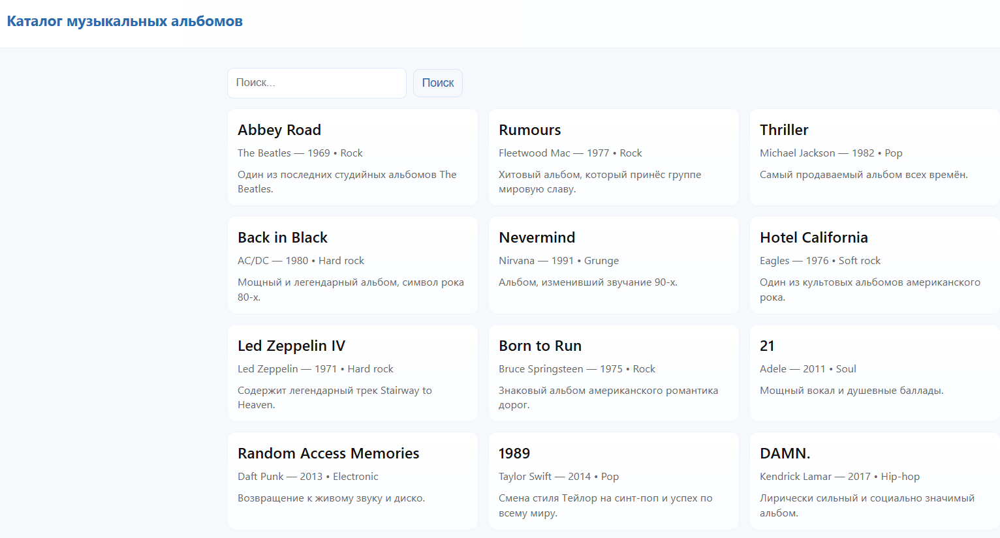
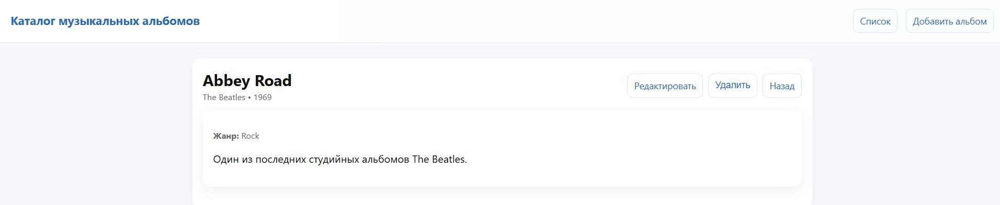
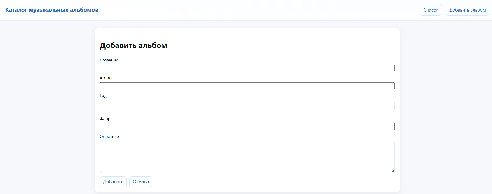
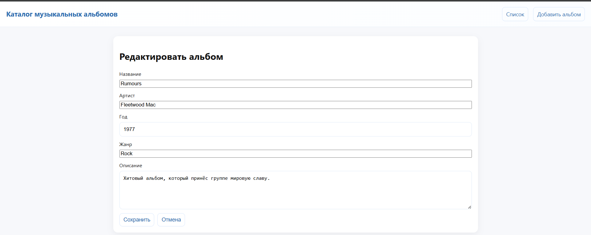
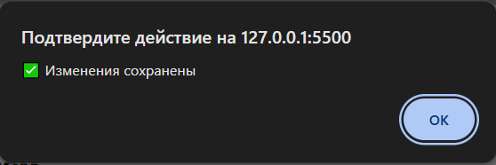
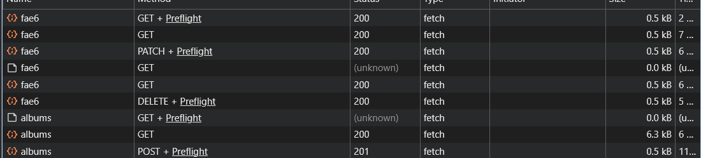

# Министерство образования Республики Беларусь

<p align="center">Учреждение образования</p>
<p align="center">“Брестский Государственный технический университет”</p>
<p align="center">Кафедра ИИТ</p>
<br><br><br><br><br><br>
<p align="center"><strong>Лабораторная работа №4</strong></p>
<p align="center"><strong>По дисциплине:</strong> “Веб-технологии”</p>
<p align="center"><strong>Тема:</strong> “REST‑клиент SPA: список/детализация/CRUD, маршрутизация (без фреймворков)”</p>
<br><br><br><br><br><br>
<p align="right"><strong>Выполнил:</strong></p>
<p align="right">Студент 4 курса</p>
<p align="right">Группы АС-63</p>
<p align="right">Ярмоловис А.С.</p>
<p align="right"><strong>Проверил:</strong></p>
<p align="right">Несюк А.Н.</p>
<br><br><br><br><br>
<p align="center"><strong>Брест 2025</strong></p>

---

## Цель работы

* Реализовать простой SPA без фреймворков с маршрутизацией и состояниями загрузки/ошибок.
* Выполнить CRUD к учебному API (реальному или mock).

---

### Вариант №24

## Ход выполнения работы

### 1. Структура проекта

- `index.html` — основная страница.
- `css/styles.css` — стилизация.
- `js/main.js` — логика на чистом JS, инициализация роутера и маршрутов.
- `js/router.js` — простой hash-маршрутизатор для SPA.
- `js/api.js` — функции для работы с REST API (CRUD альбомов).
- `js/views/albumDetail.js` — отображение деталей конкретного альбома.
- `js/views/albumForm.js` — форма для добавления и редактирования альбома.
- `js/views/albumList.js` — отображение списка альбомов с поиском и фильтрацией.
- `db.json` — база данных.

---

### 2. Описание маршрутов

| Маршрут | Описание |
|---------|----------|
| `#/albums` | Список всех альбомов |
| `#/albums/:id` | Детальная информация о конкретном альбоме |
| `#/albums/:id/edit` | Редактирование существующего альбома |
| `#/new` | Форма для добавления нового альбома |

---

### 2. Описание API

Приложение использует REST API с поддержкой CRUD.

| Метод  | URL                   | Описание |
|--------|----------------------|----------|
| GET    | `/albums`            | Получение списка альбомов (опционально с поиском: `?q=<поиск>`) |
| GET    | `/albums/:id`        | Получение одного альбома по id |
| POST   | `/albums`            | Создание нового альбома (JSON в теле запроса) |
| PATCH  | `/albums/:id`        | Редактирование альбома по id (JSON в теле запроса) |
| DELETE | `/albums/:id`        | Удаление альбома по id |

---

### 3. Запуск проекта

#### 3.1 Локальный сервер (Live Server)

* Открть проект в VSCode.
* Запустить Live Server.
* Сайт откроется по адресу:

```bash
http://127.0.0.1:5500/lab4/
```

При первом запуске хэш автоматически установится в #/albums.

---

#### 3.2 Mock‑сервер (json-server)

Для работы API без настоящей базы данных:
* Установить json-server (если ещё не установлен):

```bash
npm install -g json-server
```

* Запустить сервер:

```bash
json-server --watch db.json --port 3000
```

* Теперь API доступно по:

```bash
http://localhost:3000/albums
```

Все CRUD-запросы работают через этот mock-сервер.

---

### 4 Скриншоты

Список альбомов с состоянием loading или пустым списком.

- Список альбомов


- Состояние Loading


- Состояние Empty


Детальная страница альбома.

- Детальная страница


Форма добавления/редактирования.

- Форма добавления


- Форма редактирования


Уведомление об успешной операции.

- Уведомление об успешной операции



DevTools → Network с примерами CRUD-запросов.

- Примеры CRUD-запросов


---

## Таблица критериев

| Критерий                                                                | Баллы |  Выполнено |
|-------------------------------------------------------------------------|-------|------------|
| Семантика / UX                                                          |  20   |  ✅ / ✅  |
| Функциональность / CRUD / маршрутизация                                 |  25   |  ✅ / ✅  |
| Качество интерфейса                                                     |  20   |  ✅ / ✅  |
| Качество кода / модульность                                             |  15   |  ✅ / ✅  |
| Тесты / валидность                                                      |  10   |  ✅ / ✅  |
| Публикация и отчёт                                                      |  10   |  ✅ / ✅  |

### Дополнительные бонусы

| Бонус                                                                | Баллы | Выполнено |
| -------------------------------------------------------------------- | ----- | --------- |
| Сохранение фильтров/поиска в hash и восстановление при перезагрузке. | 10    | ✅ / ✅  |
| Предзагрузка данных (prefetch) при наведении/фокусе.                 | 10    | ❌ / ✅  |
| Простая клиентская авторизация (token в header) — если есть сервер.  | 10    | ❌ / ✅  |

---

## Ссылка на публикацию

👉 Вставьте ссылку на GitHub Pages: https://yarmolov.github.io/WT-LAB4/

## Вывод

Была выполнена лабораторная работа по созданию простой SPA без фреймворков. Приложение умеет переходить между страницами через hash-маршрутизацию и показывает состояния загрузки, ошибки и пустого списка. Реализованы все операции CRUD: просмотр списка и деталей альбомов, добавление, редактирование и удаление. Для работы использовался mock‑сервер json-server. Все функции проверялись через интерфейс и DevTools.
